# VYRON — .mjs Scripts & Subsystem Architecture Ledger

> [!NOTE]
> **Document Purpose**: This architectural ledger maps all ECMAScript Module (`.mjs`) verification suites, deterministic gate tests, forensic scanners, database seeding utilities, and dossier generators to the project's folder tree hierarchy and subsystem domains.
> 
> **Operational Compliance**: All `.mjs` scripts strictly observe the **Zero-Fiction Architecture Law** (zero fabricated test passes or synthetic telemetry) and the **Zero Raw SQL Mandate** (zero unparameterized string SQL interpolation).

---

## 1. High-Level Folder Tree Architecture & Script Topology

The VYRON platform employs a 3-tier topology for its JavaScript/ES Module execution scripts:

```
PROJECT ROOT (VYRON-main/)
├── verify-*.mjs (31 Proxy Forwarder Wrappers for root CLI convenience)
│   └── Re-exports "./scripts/testing/verify-*.mjs"
│
├── scripts/
│   ├── testing/ (111 .mjs Operational Suites)
│   │   ├── verify-*.mjs       (31 Verification & Architectural Gate Suites)
│   │   ├── test-*.mjs         (31 Subsystem & Integration Test Suites)
│   │   ├── generate-*.mjs     (9 Dossier & Artifact Generation Engines)
│   │   ├── seed-*.mjs         (4 Database Seeding & Mock Utilities)
│   │   ├── qa-*.mjs           (2 Adversarial QA & Stress Engines)
│   │   ├── scratch-*.mjs      (16 Schema Probes & Diagnostic Probes)
│   │   └── forensic utilities (18 Forensic Sweeps, Autopsies & Analyzers)
│   ├── powershell/            (Automated PowerShell orchestration runners)
│   └── python/                (Python AST verification helpers)
│
├── .agents/
│   └── VYRON-main/            (90 Historical Autonomous Agent Session Scripts)
│       └── Historical snapshots used during early multi-phase convergence
│
├── src/                       (Target Codebase Under Governance)
│   ├── components/            (UI Components & Control Plane Views)
│   ├── routes/                (TanStack Router SSR Route Handlers)
│   ├── services/              (AI Engines, Dispatchers, Connectors, Security)
│   ├── state/                 (Zustand Stores & React Query Hooks)
│   └── contexts/              (Demo Mode & System Context Providers)
│
└── supabase/
    └── migrations/            (PostgreSQL DDL & RLS Security Policies)
```

---

## 2. Architectural Subsystem Mapping Matrix

The table below correlates each subsystem within `src/` and `supabase/` to its corresponding `.mjs` verification, testing, and forensic scripts:

| Architectural Subsystem | Target Source Tree (`src/` / `supabase/`) | Primary `.mjs` Verification Suites | Automated Test & Diagnostic Scripts |
| :--- | :--- | :--- | :--- |
| **Copilot Intelligence Fabric** | `src/services/copilot/`<br>`src/state/copilot/`<br>`src/components/copilot/` | [verify-continuation-mission.mjs](file:///c:/Users/Phanindra/OneDrive/Desktop/PANDU-FINAL%20YEAR%20PROJECTS/PROJECT-VYRON/VYRON-main/scripts/testing/verify-continuation-mission.mjs)<br>[verify-copilot-intelligence-fabric.mjs](file:///c:/Users/Phanindra/OneDrive/Desktop/PANDU-FINAL%20YEAR%20PROJECTS/PROJECT-VYRON/VYRON-main/scripts/testing/verify-copilot-intelligence-fabric.mjs)<br>[verify-copilot-advancement.mjs](file:///c:/Users/Phanindra/OneDrive/Desktop/PANDU-FINAL%20YEAR%20PROJECTS/PROJECT-VYRON/VYRON-main/scripts/testing/verify-copilot-advancement.mjs)<br>[verify-nextgen-copilot.mjs](file:///c:/Users/Phanindra/OneDrive/Desktop/PANDU-FINAL%20YEAR%20PROJECTS/PROJECT-VYRON/VYRON-main/scripts/testing/verify-nextgen-copilot.mjs) | `test-copilot-godmode.mjs`<br>`test-copilot-godmode-omega.mjs` |
| **Dual-Provider AI Routing & LLM Gateway** | `src/services/ai/`<br>`src/services/llmGateway.ts` | [verify-ai-dual-provider-control-plane.mjs](file:///c:/Users/Phanindra/OneDrive/Desktop/PANDU-FINAL%20YEAR%20PROJECTS/PROJECT-VYRON/VYRON-main/scripts/testing/verify-ai-dual-provider-control-plane.mjs)<br>[verify-ai-platform.mjs](file:///c:/Users/Phanindra/OneDrive/Desktop/PANDU-FINAL%20YEAR%20PROJECTS/PROJECT-VYRON/VYRON-main/scripts/testing/verify-ai-platform.mjs) | `test-llm-gateway.mjs`<br>`seed-ai-discovery.mjs` |
| **14-Stage AI Project Control Plane** | `src/routes/app.projects.*`<br>`src/components/projectControlPlane/` | [verify-ai-project-control-plane.mjs](file:///c:/Users/Phanindra/OneDrive/Desktop/PANDU-FINAL%20YEAR%20PROJECTS/PROJECT-VYRON/VYRON-main/scripts/testing/verify-ai-project-control-plane.mjs)<br>[verify-new-project-god-mode-vnext.mjs](file:///c:/Users/Phanindra/OneDrive/Desktop/PANDU-FINAL%20YEAR%20PROJECTS/PROJECT-VYRON/VYRON-main/scripts/testing/verify-new-project-god-mode-vnext.mjs)<br>[verify-engineering-navigation.mjs](file:///c:/Users/Phanindra/OneDrive/Desktop/PANDU-FINAL%20YEAR%20PROJECTS/PROJECT-VYRON/VYRON-main/scripts/testing/verify-engineering-navigation.mjs) | `test-godmode-40steps.mjs`<br>`test-godmode-vnext-master.mjs` |
| **Backend Sentinel & Cryptographic Security** | `src/services/security/`<br>`src/services/releaseGateEngine.ts` | [verify-backend-sentinel-nuclear.mjs](file:///c:/Users/Phanindra/OneDrive/Desktop/PANDU-FINAL%20YEAR%20PROJECTS/PROJECT-VYRON/VYRON-main/scripts/testing/verify-backend-sentinel-nuclear.mjs)<br>[verify-adversarial-platform.mjs](file:///c:/Users/Phanindra/OneDrive/Desktop/PANDU-FINAL%20YEAR%20PROJECTS/PROJECT-VYRON/VYRON-main/scripts/testing/verify-adversarial-platform.mjs) | `test-adversarial-security.mjs`<br>`test-crypto.mjs`<br>`qa-adversarial-master.mjs` |
| **Realtime Activity Stream & Telemetry** | `src/routes/app.activity.tsx`<br>`src/components/activity/`<br>`src/services/activity/` | [verify-activity-workpulse.mjs](file:///c:/Users/Phanindra/OneDrive/Desktop/PANDU-FINAL%20YEAR%20PROJECTS/PROJECT-VYRON/VYRON-main/scripts/testing/verify-activity-workpulse.mjs)<br>[verify-activity-browser.mjs](file:///c:/Users/Phanindra/OneDrive/Desktop/PANDU-FINAL%20YEAR%20PROJECTS/PROJECT-VYRON/VYRON-main/scripts/testing/verify-activity-browser.mjs) | `test-realtime.mjs`<br>`seed-audit-logs.mjs` |
| **External Connectors (GitHub, Kaggle, MCP)** | `src/services/github/`<br>`src/routes/app.connectors.tsx`<br>`src/components/connectors/` | [verify-github-connector.mjs](file:///c:/Users/Phanindra/OneDrive/Desktop/PANDU-FINAL%20YEAR%20PROJECTS/PROJECT-VYRON/VYRON-main/scripts/testing/verify-github-connector.mjs)<br>[verify-github-browser.mjs](file:///c:/Users/Phanindra/OneDrive/Desktop/PANDU-FINAL%20YEAR%20PROJECTS/PROJECT-VYRON/VYRON-main/scripts/testing/verify-github-browser.mjs)<br>[verify-ecosystem-control-plane.mjs](file:///c:/Users/Phanindra/OneDrive/Desktop/PANDU-FINAL%20YEAR%20PROJECTS/PROJECT-VYRON/VYRON-main/scripts/testing/verify-ecosystem-control-plane.mjs) | `test-gh-rpcs.mjs`<br>`test-gh-tables-crud.mjs`<br>`test-rls-gh.mjs` |
| **Forensics, Drift Analysis & Validation Studio** | `src/routes/app.analysis.tsx`<br>`src/components/analysis/`<br>`src/components/reports/` | [verify-drift-report.mjs](file:///c:/Users/Phanindra/OneDrive/Desktop/PANDU-FINAL%20YEAR%20PROJECTS/PROJECT-VYRON/VYRON-main/scripts/testing/verify-drift-report.mjs)<br>[verify-intelligence-layer.mjs](file:///c:/Users/Phanindra/OneDrive/Desktop/PANDU-FINAL%20YEAR%20PROJECTS/PROJECT-VYRON/VYRON-main/scripts/testing/verify-intelligence-layer.mjs)<br>[verify-gate-status.mjs](file:///c:/Users/Phanindra/OneDrive/Desktop/PANDU-FINAL%20YEAR%20PROJECTS/PROJECT-VYRON/VYRON-main/scripts/testing/verify-gate-status.mjs) | `run-forensic-audit.mjs`<br>`forensic-sweep.mjs`<br>`run_full_forensic.mjs` |
| **Interactive Operations & System Flows** | `src/routes/app.system-flow.tsx`<br>`src/components/systemFlow/`<br>`src/components/demo/` | [verify-interactive-command-center.mjs](file:///c:/Users/Phanindra/OneDrive/Desktop/PANDU-FINAL%20YEAR%20PROJECTS/PROJECT-VYRON/VYRON-main/scripts/testing/verify-interactive-command-center.mjs)<br>[verify-nextgen-command-center.mjs](file:///c:/Users/Phanindra/OneDrive/Desktop/PANDU-FINAL%20YEAR%20PROJECTS/PROJECT-VYRON/VYRON-main/scripts/testing/verify-nextgen-command-center.mjs)<br>[verify-system-live.mjs](file:///c:/Users/Phanindra/OneDrive/Desktop/PANDU-FINAL%20YEAR%20PROJECTS/PROJECT-VYRON/VYRON-main/scripts/testing/verify-system-live.mjs) | `test-nuclear-architecture-godmode.mjs`<br>`test-blueprint-release-godmode-ultima.mjs` |
| **Website Generator Studio** | `src/routes/app.studio.*`<br>`src/components/studio/` | [verify-website-generation.mjs](file:///c:/Users/Phanindra/OneDrive/Desktop/PANDU-FINAL%20YEAR%20PROJECTS/PROJECT-VYRON/VYRON-main/scripts/testing/verify-website-generation.mjs)<br>[verify-wizard-v2.mjs](file:///c:/Users/Phanindra/OneDrive/Desktop/PANDU-FINAL%20YEAR%20PROJECTS/PROJECT-VYRON/VYRON-main/scripts/testing/verify-wizard-v2.mjs) | `scratch-check-website-tables.mjs` |
| **Supabase Database & RLS Security** | `supabase/migrations/`<br>`src/integrations/supabase/` | [verify-step1-8.mjs](file:///c:/Users/Phanindra/OneDrive/Desktop/PANDU-FINAL%20YEAR%20PROJECTS/PROJECT-VYRON/VYRON-main/scripts/testing/verify-step1-8.mjs) | `test-supabase-skill-verification.mjs`<br>`test-crud.mjs`<br>`diagnose-rls.mjs`<br>`scratch-check-tables.mjs` |
| **Canonical Dossier & Spec Convergence** | `docs/architecture/` | [verify-canonical-phase-dossier.mjs](file:///c:/Users/Phanindra/OneDrive/Desktop/PANDU-FINAL%20YEAR%20PROJECTS/PROJECT-VYRON/VYRON-main/scripts/testing/verify-canonical-phase-dossier.mjs)<br>[verify-canonical-dossier-50x26.mjs](file:///c:/Users/Phanindra/OneDrive/Desktop/PANDU-FINAL%20YEAR%20PROJECTS/PROJECT-VYRON/VYRON-main/scripts/testing/verify-canonical-dossier-50x26.mjs) | `generate-canonical-dossier-250x104.mjs`<br>`generate-nuclear-dossier-250x104.mjs`<br>`generate-final-acceptance-report.mjs` |

---

## 3. Visual Architecture Flow

```mermaid
graph TD
    subgraph Client_CLI ["CLI Invocations (Root / npm scripts)"]
        NPM_VERIFY["npm run verify / verify:step1-8"]
        ROOT_MJS["Root: node verify-*.mjs (31 wrappers)"]
    end

    subgraph Script_Core ["Operational Testing Engine (scripts/testing/)"]
        VERIFY_ENGINE["Verification Suites (verify-*.mjs)"]
        TEST_ENGINE["Integration Tests (test-*.mjs)"]
        GEN_ENGINE["Dossier Generators (generate-*.mjs)"]
        SEED_ENGINE["DB Seeders (seed-*.mjs)"]
        PROBE_ENGINE["Forensic Probes (scratch-*.mjs)"]
    end

    subgraph Subsystems ["VYRON Application Subsystems (src/)"]
        COPILOT["Copilot Intelligence Fabric\n(src/services/copilot)"]
        AI_GATEWAY["Dual-Provider AI Gateway\n(src/services/ai)"]
        CONTROL_PLANE["14-Stage Project Control Plane\n(src/components/projectControlPlane)"]
        SENTINEL["Backend Sentinel & Security\n(src/services/security)"]
        ACTIVITY["Realtime Activity Stream\n(src/routes/app.activity.tsx)"]
        CONNECTORS["GitHub & Ecosystem Connectors\n(src/services/github)"]
        SYSTEM_FLOW["System Flows & Simulation Lab\n(src/components/systemFlow)"]
    end

    subgraph Storage ["Database & Documentation Layer"]
        SUPABASE["Supabase PostgreSQL (Migrations & RLS)"]
        DOSSIERS["Enterprise Dossiers (docs/architecture/)"]
    end

    ROOT_MJS --> VERIFY_ENGINE
    NPM_VERIFY --> VERIFY_ENGINE

    VERIFY_ENGINE --> COPILOT
    VERIFY_ENGINE --> AI_GATEWAY
    VERIFY_ENGINE --> CONTROL_PLANE
    VERIFY_ENGINE --> SENTINEL
    VERIFY_ENGINE --> ACTIVITY
    VERIFY_ENGINE --> CONNECTORS
    VERIFY_ENGINE --> SYSTEM_FLOW

    TEST_ENGINE --> SUPABASE
    PROBE_ENGINE --> SUPABASE
    SEED_ENGINE --> SUPABASE
    GEN_ENGINE --> DOSSIERS
```



---

## 4. Complete Directory Catalog of .mjs Scripts

### 4.1. Root Directory Proxy Forwarders (`./`) — 31 Files
These files reside directly at the project root to support frictionless invocation without requiring path navigation:

```
verify-activity-browser.mjs               -> scripts/testing/verify-activity-browser.mjs
verify-activity-workpulse.mjs             -> scripts/testing/verify-activity-workpulse.mjs
verify-adversarial-platform.mjs           -> scripts/testing/verify-adversarial-platform.mjs
verify-ai-dual-provider-control-plane.mjs -> scripts/testing/verify-ai-dual-provider-control-plane.mjs
verify-ai-platform.mjs                    -> scripts/testing/verify-ai-platform.mjs
verify-ai-project-control-plane.mjs       -> scripts/testing/verify-ai-project-control-plane.mjs
verify-backend-sentinel-nuclear.mjs       -> scripts/testing/verify-backend-sentinel-nuclear.mjs
verify-browser.mjs                        -> scripts/testing/verify-browser.mjs
verify-canonical-dossier-50x26.mjs        -> scripts/testing/verify-canonical-dossier-50x26.mjs
verify-canonical-phase-dossier.mjs        -> scripts/testing/verify-canonical-phase-dossier.mjs
verify-continuation-advancement.mjs       -> scripts/testing/verify-continuation-advancement.mjs
verify-continuation-mission.mjs           -> scripts/testing/verify-continuation-mission.mjs
verify-copilot-advancement.mjs            -> scripts/testing/verify-copilot-advancement.mjs
verify-copilot-intelligence-fabric.mjs    -> scripts/testing/verify-copilot-intelligence-fabric.mjs
verify-drift-report.mjs                   -> scripts/testing/verify-drift-report.mjs
verify-ecosystem-control-plane.mjs        -> scripts/testing/verify-ecosystem-control-plane.mjs
verify-engineering-navigation.mjs         -> scripts/testing/verify-engineering-navigation.mjs
verify-gate-status.mjs                    -> scripts/testing/verify-gate-status.mjs
verify-github-browser.mjs                 -> scripts/testing/verify-github-browser.mjs
verify-github-connector.mjs               -> scripts/testing/verify-github-connector.mjs
verify-intelligence-layer.mjs             -> scripts/testing/verify-intelligence-layer.mjs
verify-interactive-command-center.mjs     -> scripts/testing/verify-interactive-command-center.mjs
verify-new-project-god-mode-vnext.mjs     -> scripts/testing/verify-new-project-god-mode-vnext.mjs
verify-nextgen-command-center.mjs         -> scripts/testing/verify-nextgen-command-center.mjs
verify-nextgen-copilot.mjs                -> scripts/testing/verify-nextgen-copilot.mjs
verify-platform-evolution.mjs             -> scripts/testing/verify-platform-evolution.mjs
verify-platform-mastery.mjs               -> scripts/testing/verify-platform-mastery.mjs
verify-step1-8.mjs                        -> scripts/testing/verify-step1-8.mjs
verify-system-live.mjs                    -> scripts/testing/verify-system-live.mjs
verify-website-generation.mjs             -> scripts/testing/verify-website-generation.mjs
verify-wizard-v2.mjs                      -> scripts/testing/verify-wizard-v2.mjs
```

---

### 4.2. Operational Suites (`scripts/testing/`) — 111 Files

#### A. Deterministic Verification Suites (31 files)
- **[verify-continuation-mission.mjs](file:///c:/Users/Phanindra/OneDrive/Desktop/PANDU-FINAL%20YEAR%20PROJECTS/PROJECT-VYRON/VYRON-main/scripts/testing/verify-continuation-mission.mjs)**: 8-gate test verifying Copilot dispatcher, memory context injection, dual-persona mode, and Zero Raw SQL compliance.
- **[verify-ai-project-control-plane.mjs](file:///c:/Users/Phanindra/OneDrive/Desktop/PANDU-FINAL%20YEAR%20PROJECTS/PROJECT-VYRON/VYRON-main/scripts/testing/verify-ai-project-control-plane.mjs)**: 20-gate test certifying the 14-stage AI project control plane.
- **[verify-backend-sentinel-nuclear.mjs](file:///c:/Users/Phanindra/OneDrive/Desktop/PANDU-FINAL%20YEAR%20PROJECTS/PROJECT-VYRON/VYRON-main/scripts/testing/verify-backend-sentinel-nuclear.mjs)**: 10-gate test verifying cryptographic hashing, release-gate state transitions, and audit trail security.
- **[verify-new-project-god-mode-vnext.mjs](file:///c:/Users/Phanindra/OneDrive/Desktop/PANDU-FINAL%20YEAR%20PROJECTS/PROJECT-VYRON/VYRON-main/scripts/testing/verify-new-project-god-mode-vnext.mjs)**: 28-gate test certifying high-density workspace UI, live telemetry gauges, and stage-by-stage contract validation.
- **[verify-github-connector.mjs](file:///c:/Users/Phanindra/OneDrive/Desktop/PANDU-FINAL%20YEAR%20PROJECTS/PROJECT-VYRON/VYRON-main/scripts/testing/verify-github-connector.mjs)**: Certifies GitHub sync engine, repository bindings, webhook handlers, and RLS tenant separation.
- **[verify-activity-workpulse.mjs](file:///c:/Users/Phanindra/OneDrive/Desktop/PANDU-FINAL%20YEAR%20PROJECTS/PROJECT-VYRON/VYRON-main/scripts/testing/verify-activity-workpulse.mjs)**: Validates real-time activity stream latency (<2s), pause buffer, and 1,000-event virtualized throughput.
- **[verify-canonical-phase-dossier.mjs](file:///c:/Users/Phanindra/OneDrive/Desktop/PANDU-FINAL%20YEAR%20PROJECTS/PROJECT-VYRON/VYRON-main/scripts/testing/verify-canonical-phase-dossier.mjs)**: Asserts the exact 100,000 ASCII character target and structural completeness of the enterprise architecture dossier.
- *(Additional suites: `verify-adversarial-platform.mjs`, `verify-ai-dual-provider-control-plane.mjs`, `verify-ai-platform.mjs`, `verify-browser.mjs`, `verify-continuation-advancement.mjs`, `verify-copilot-advancement.mjs`, `verify-copilot-intelligence-fabric.mjs`, `verify-drift-report.mjs`, `verify-ecosystem-control-plane.mjs`, `verify-engineering-navigation.mjs`, `verify-gate-status.mjs`, `verify-github-browser.mjs`, `verify-intelligence-layer.mjs`, `verify-interactive-command-center.mjs`, `verify-nextgen-command-center.mjs`, `verify-nextgen-copilot.mjs`, `verify-platform-evolution.mjs`, `verify-platform-mastery.mjs`, `verify-step1-8.mjs`, `verify-system-live.mjs`, `verify-website-generation.mjs`, `verify-wizard-v2.mjs`)*.

#### B. Automated Integration & Godmode Test Suites (31 files)
- `test-acceptance-gates.mjs`: Release-readiness assertion gates.
- `test-adversarial-security.mjs`: Injection and bypass attack testing against API gateways.
- `test-blueprint-release-godmode-ultima.mjs`: End-to-end blueprint deployment test.
- `test-cicd-guardrail-godmode.mjs`: CI/CD automated policy and linting assertion.
- `test-copilot-godmode.mjs` & `test-copilot-godmode-omega.mjs`: Deep stress testing of LLM intent classification and execution.
- `test-crud.mjs`: Supabase PostgREST query builder CRUD validation.
- `test-crypto.mjs`: SHA-256 HMAC and cryptographic seal verification.
- `test-llm-gateway.mjs`: Fallback and round-robin testing between Gemini, Groq, and Mock adapters.
- `test-nuclear-architecture-godmode.mjs`: Deep system state consistency tests.
- `test-realtime.mjs`: Supabase Realtime broadcast and channel subscription tests.
- `test-supabase-skill-verification.mjs`: Supabase skill guideline and schema compliance checker.
- *(Additional test files: `test-columns-deep.mjs`, `test-endpoints.mjs`, `test-from-scratch-harness.mjs`, `test-gh-rpcs.mjs`, `test-gh-tables-crud.mjs`, `test-godmode-40steps.mjs`, `test-godmode-vnext-master.mjs`, `test-godmode-vnext-scratch-testing.mjs`, `test-insert.mjs`, `test-macro-batch-1.mjs` through `test-macro-batch-5.mjs`, `test-p1-integrity.mjs`, `test-rls-gh.mjs`, `test-rls-project-repos.mjs`, `test-rpc-sql.mjs`, `test-task-crud.mjs`)*.

#### C. Enterprise Dossier & Artifact Generators (9 files)
- `generate-canonical-dossier-250x104.mjs`: Synthesizes the 250-Phase Enterprise Convergence Dossier.
- `generate-nuclear-dossier-250x104.mjs`: Generates the backend nuclear architecture specification.
- `generate-cicd-dossier-250x104.mjs`: Produces CI/CD deployment and governance matrices.
- `generate-blueprint-release-dossier-250x104.mjs`: Produces the release gate blueprint.
- `generate-final-acceptance-report.mjs`: Compiles the final production acceptance sign-off.
- *(Additional generators: `generate-backend-artifacts.mjs`, `generate-canonical-dossier-50x26.mjs`, `generate-canonical-dossier-50x52.mjs`, `generate-nuclear-architecture-artifacts.mjs`)*.

#### D. Database Seeding & Mock Utilities (4 files)
- `seed-ai-discovery.mjs`: Seeds sample datasets, AI benchmarks, and models into database tables.
- `seed-audit-logs.mjs`: Generates realistic governance audit trails for administrative review.
- `seed-database.mjs`: Core database fixture seeder for local dev and testing.
- `seed-industrial-scale.mjs`: Ingests high-volume records to test index performance and table partitioning.

#### E. Forensic Sweeps, Autopsies & Analyzers (18 files)
- `diagnose-rls.mjs`: Inspects PostgreSQL Row Level Security policies for permissions leaks.
- `db-autopsy.mjs` & `run-db-autopsy-full.mjs`: Deep database state and constraint analyzer.
- `forensic-sweep.mjs` & `run-forensic-audit.mjs`: AST codebase sweep looking for anti-patterns or hardcoded secrets.
- `inspect-columns.mjs`, `inspect-gh-cols.mjs`, `inspect-gh-schema.mjs`: PostgREST schema introspection tools.
- `load-test-brahma.mjs`: High-load concurrent request simulator.
- *(Additional utilities: `autopsy.mjs`, `build-defect-forensics.mjs`, `build-v3-master-prompt.mjs`, `check-tables.mjs`, `compile_v3_batch1.mjs`, `investigate-t6.mjs`, `launch-sample-browser.mjs`, `run_full_forensic.mjs`, `update-dossier-script.mjs`)*.

#### F. Scratch Diagnostics & Probes (16 files)
- Transient schema and auth exploration scripts: `scratch-check-active-tables.mjs`, `scratch-check-github-tables.mjs`, `scratch-check-projects.mjs`, `scratch-check-schema.mjs`, `scratch-check-website-tables.mjs`, `scratch-find-tables.mjs`, `scratch-probe-auth.mjs`, `scratch-probe-newproject.mjs`, `scratch-probe-tables.mjs`, `scratch-probe-ui.mjs`, `scratch-sweep7.mjs`, `scratch-test-assets.mjs`, `scratch-test-columns.mjs`, `scratch-test-db.mjs`, `scratch-test-endpoints.mjs`, `scratch-test-sql-api.mjs`.

---

## 5. Execution Reference & Developer Commands

### Running Individual Verification Suites
```powershell
# Run from repository root using proxy forwarders:
node verify-continuation-mission.mjs
node verify-ai-project-control-plane.mjs
node verify-backend-sentinel-nuclear.mjs
node verify-new-project-god-mode-vnext.mjs
```

### Running via Central Testing Engine
```powershell
# Run directly from the operational scripts folder:
node scripts/testing/verify-activity-workpulse.mjs
node scripts/testing/verify-github-connector.mjs
node scripts/testing/test-crud.mjs
```

### Running Package.json Scripts
```powershell
# Executes scripts/testing/verify-step1-8.mjs
npm run verify

# Runs gates suite
npm test
```

---

## 6. Architecture Maintenance Protocol

1. **New Verification Scripts**: Any new `.mjs` verification suite MUST be authored inside [scripts/testing/](file:///c:/Users/Phanindra/OneDrive/Desktop/PANDU-FINAL%20YEAR%20PROJECTS/PROJECT-VYRON/VYRON-main/scripts/testing/) and follow deterministic assertion standards.
2. **Root Wrappers**: If direct root CLI access is desired, create a single-line forwarder in the root: `import "./scripts/testing/<script-name>.mjs";`.
3. **Zero Raw SQL Enforcement**: Every script querying PostgreSQL MUST use the Supabase PostgREST client SDK or typed query builder; never construct raw string SQL queries.
4. **Historical Isolation**: The [.agents/](file:///c:/Users/Phanindra/OneDrive/Desktop/PANDU-FINAL%20YEAR%20PROJECTS/PROJECT-VYRON/VYRON-main/.agents/) directory is reserved as an archival ledger for agent session histories and should not be modified by standard application workflows.
