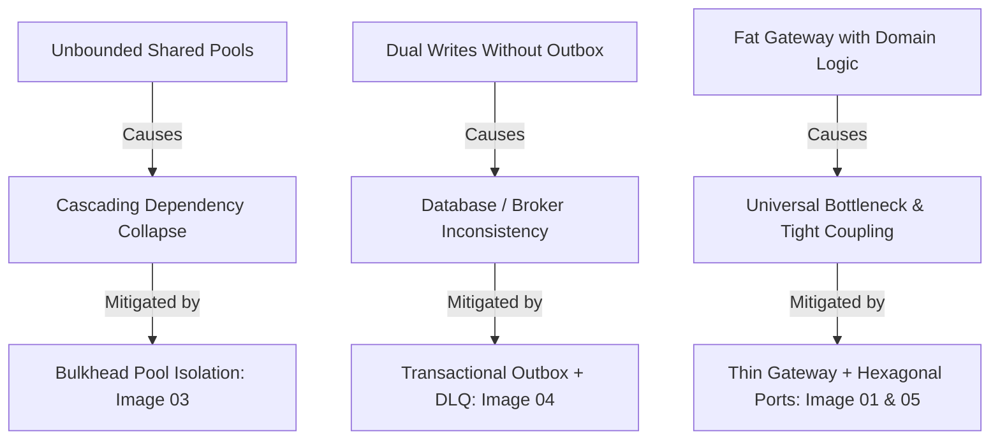

# VYRON — IMAGE-DRIVEN ARCHITECTURE ROOT CAUSE MAP
**GOD MODE vULTIMA ΩΩΩΩΩΩΩΩ — CAUSAL INVESTIGATION & DEFECT MITIGATION**

## 1. Causal Architecture Fault Tree

## 2. Mitigated Architecture Anti-Patterns
1. **The Magic "Exactly-Once" Myth:** Image 04 claimed exactly-once delivery. In real distributed systems, network partitions make true exactly-once impossible without end-to-end consensus. VYRON mitigates this by enforcing **Idempotency Keys + Deduplication + Replay-Safe Consumers**.
2. **The "Fat Gateway" Anti-Pattern:** Image 01 depicts routing, rate-limiting, and transformation. If domain logic leaks into the gateway, it becomes a single monolithic failure point. VYRON keeps the gateway strictly **thin and policy-aware**, delegating business use cases to the Hexagonal Core.
