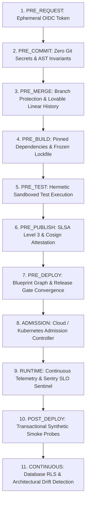

# VYRON — CI/CD PIPELINE & GUARDRAIL CONTROL PLANE ARCHITECTURE
**GOD MODE vULTIMA ΩΩΩΩΩΩΩΩΩΩ — LAYERED TRUST BOUNDARIES × AI GOVERNANCE × SUPPLY-CHAIN CONVERGENCE**
**Document Version:** 2.5.0-CANONICAL
**Classification:** RESTRICTED — ARCHITECTURAL SPECIFICATION

---

## 1. Executive Summary & Core Mandate
VYRON's delivery system transforms continuous integration and delivery from a static YAML pipeline into a living, causal **Release Control Plane**. Every code delta is bound to immutable provenance, evaluated against layered Policy-as-Code (OPA Rego) engines across **11 Guardrail Planes**, attested via **SLSA v1.0 Level 3** and **Sigstore Cosign**, and gated by a dual-observer Three-Way Convergence protocol before progressive canary rollout and automated 45-second rollback.

### The Inviolable Delivery Laws
- **VALIDATION > GENERATION**: Claims must be proven by deterministic static and dynamic checks.
- **OBSERVATION > ASSUMPTION**: Runtime state must be observed via browser and backend sentinels, not presumed.
- **EVIDENCE > ASSERTION**: Visual badges cannot bypass cryptographic evidence IDs.
- **POLICY > CONVENIENCE**: Monotonic security rules cannot be waived without time-bounded dual-custody authority.
- **LEAST PRIVILEGE > BROAD ACCESS**: Ephemeral OIDC federated identities over static secrets.
- **IMMUTABLE ARTIFACT > REBUILD-ON-DEMAND**: Deterministic bundles sealed with SHA-256 hashes.
- **CANARY > BIG-BANG**: Progressive traffic shifting (10% $\to$ 50% $\to$ 100%) with automated error-budget tripwires.
- **ROLLBACK > HOPE**: Reversible state transition with RTO $\le 45\text{s}$.
- **UNKNOWN > FABRICATION**: Missing telemetry yields explicit `BLOCKED` or `UNKNOWN`, never a false green.

---

## 2. The 11 Guardrail Planes

| Plane | Name | Severity | Primary Rule Expression | Remediation Action |
| :--- | :--- | :--- | :--- | :--- |
| `PRE_REQUEST` | OIDC Short-Lived Identity | `BLOCKING` | `token.isOidcShortLived && token.exp <= 3600` | Exchange cloud workload identity federation tokens. |
| `PRE_COMMIT` | Zero Secrets in Git AST | `BLOCKING` | `secretScanner.find(commit.diff).length === 0` | Remove sensitive keys; store in Supabase Vault. |
| `PRE_MERGE` | Branch & Linear History | `BLOCKING` | `pr.approvals >= 2 && !pr.hasForcePush` | Enforce Lovable linear git history preservation. |
| `PRE_BUILD` | Deterministic Dependencies | `BLOCKING` | `lockfile.isFrozen && lockfile.integrityMatches` | Run `bun install --frozen-lockfile`. |
| `PRE_TEST` | Hermetic Test Isolation | `HIGH` | `runner.isHermetic && !runner.hasEgress` | Run suites in isolated runner network sandbox. |
| `PRE_PUBLISH` | SLSA L3 & Cosign Attestation | `BLOCKING` | `artifact.slsaLevel >= 'SLSA_BUILD_L3'` | Sign OCI image using Cosign with GitHub OIDC identity. |
| `PRE_DEPLOY` | Blueprint Gate Convergence | `BLOCKING` | `releaseGateEngine.blockingGates.length === 0` | Resolve all failing Blueprint release gates. |
| `ADMISSION` | Cloud Admission Policy | `BLOCKING` | `image.isCosignVerified && !container.runsAsRoot`| Enforce non-root execution and verified signatures. |
| `RUNTIME` | SLO Sentinel & Error Spike | `CRITICAL` | `metrics.p99LatencyMs <= 300 && errorRate <= 0.001`| Trip automated canary rollback on error breach. |
| `POST_DEPLOY`| Synthetic Smoke Journey | `BLOCKING` | `syntheticProbe.status === 'PASSED'` | Run end-to-end user workspace validation probes. |
| `CONTINUOUS` | AST & RLS Drift Sentinel | `HIGH` | `driftEngine.criticalDriftCount === 0` | Re-verify database RLS and code AST boundaries. |

---

## 3. Supply-Chain Provenance Architecture
- **SLSA v1.0 Level 3**: Every build artifact produces non-forgeable, hosted provenance documenting:
  - Source git repository and exact immutable commit SHA.
  - Builder ID (`https://github.com/actions/runner-linux-x64`).
  - Input parameters, build triggers, and environment configurations.
- **Sigstore Cosign**: Cryptographically seals artifacts using ephemeral X.509 certificates issued via Sigstore Fulcio based on GitHub Actions OIDC identity tokens, recorded into the public Rekor transparency log.
- **CycloneDX SBOM**: Comprehensive Software Bill of Materials tracking all 108 direct and transitive packages with verified SHA-256 hashes.

---

## 4. AI Release Governor Architecture
The AI Release Governor acts as an automated release coordinator operating under strict containment:
1. **Zero Secret / Chain Leakage**: Never exposes internal reasoning scratchpads, private system prompts, or hidden tokens.
2. **Deterministic 8-Part Structure**:
   - `UNDERSTOOD`: Formal declaration of the deployment intent.
   - `CONTEXT`: Target environment, artifact digest, graph revision, and active policies.
   - `SOURCES`: Exact repository workflow references and schema endpoints.
   - `TOOLS USED`: Explicit registry tools invoked during assessment.
   - `EVIDENCE`: Cryptographic hashes and test suite receipts.
   - `CHECKS`: Hard invariants verified (Zero raw SQL, RLS isolation, SLSA provenance, Rollback RTO).
   - `RESULT`: Clear authorization verdict.
   - `NEXT STEP`: Prescribed deployment phase (e.g. advance 10% canary).
3. **Bounded Autonomy**: The governor can simulate, analyze, and propose release actions, but cannot self-approve production promotions without dual-custody peer architect cryptographic signatures.

---

## 5. Three-Way Convergence Protocol
At every promotion boundary, the control plane cross-checks three distinct observers:
1. **Browser Observer**: Real-time headless execution validating HTTP 200 responses, zero console exceptions, and DOM gate badge state.
2. **Canonical Backend Sentinel**: Live PostgreSQL/Supabase database health, RPC pass rate ($100\%$), and WORM audit compliance.
3. **Blueprint Projection**: Dynamic graph revision counter, readiness score ($\ge 90\%$), and blocking gate count ($0$).

Any discrepancy between these three planes immediately flags a **Convergence Defect** (`EDGE-STATE-MISMATCH`), pausing promotion waves.

---

## 6. Progressive Delivery & Reversible Rollback
- **Canary Waves**: 10% initial ingress $\to$ 15-minute telemetry observation $\to$ 50% wave $\to$ 100% full promotion.
- **Automated Rollback Trigger**: If error rates exceed $0.1\%$ or P99 latency exceeds $300\text{ms}$ during canary observation, traffic automatically reverts to the baseline revision within $45$ seconds (RTO $\le 45\text{s}$).
