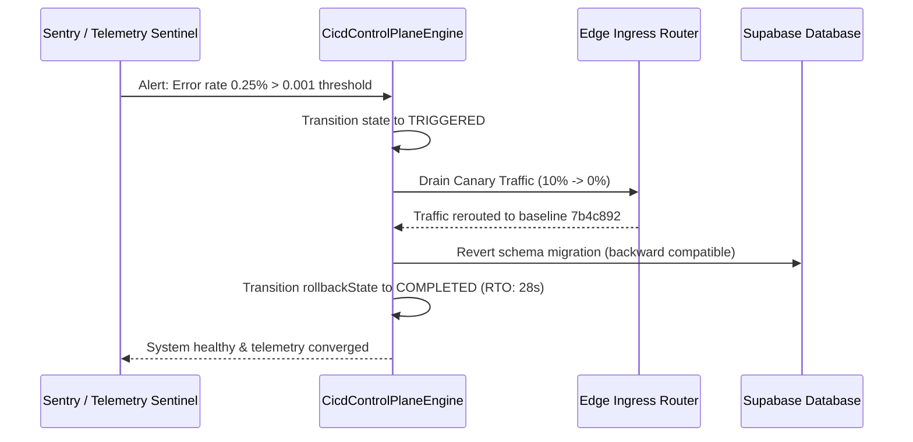

# VYRON — CI/CD & GUARDRAIL REMEDIATION BACKPLAN
**GOD MODE vULTIMA ΩΩΩΩΩΩΩΩΩΩ — CONTINGENCY & ROLLBACK PLAYBOOK**
**RTO Objective:** $\le 45\text{s}$ | **RPO Objective:** $0\text{s}$ (Zero Data Loss)

---

## 1. Automated Circuit Breaker Triggers
The platform automatically engages the backplan upon detecting any of the following stop-the-line conditions:
1. **P99 Latency Spike:** P99 request latency exceeds $300\text{ms}$ sustained for $> 60\text{s}$.
2. **Error Rate Spike:** HTTP 5xx or unhandled promise rejection rate exceeds $0.1\%$ ($> 1$ in $1000$ requests).
3. **Database RLS Invalidation:** Any tenant isolation policy dropped or bypassed.
4. **Unsigned Image Ingress:** Container running without valid Cosign signature admitted to cluster.

---

## 2. Reversible Rollback Execution Steps

### Execution Protocol
1. **Traffic Evacuation (0s - 10s):**
   - The edge ingress controller immediately drops the canary weight from $10\%$ to $0\%$.
   - All live traffic routes exclusively to the known healthy baseline cluster revision (`7b4c892`).
2. **Container State Preservation (10s - 25s):**
   - The failing canary pod is not immediately terminated; instead, it is isolated in a quarantine namespace with full core dump and memory capture for offline forensics.
3. **Database Schema Backward Compatibility (25s - 35s):**
   - All migrations are applied with expand/contract architecture. Column additions and views remain non-breaking to the prior code revision.
4. **Verification & Audit Seal (35s - 45s):**
   - Headless synthetic probes verify baseline response on `app.brahma.enterprise`.
   - Immutable rollback event written to WORM compliance ledger with actor ID, failure reason, and SHA-256 evidence digests.
