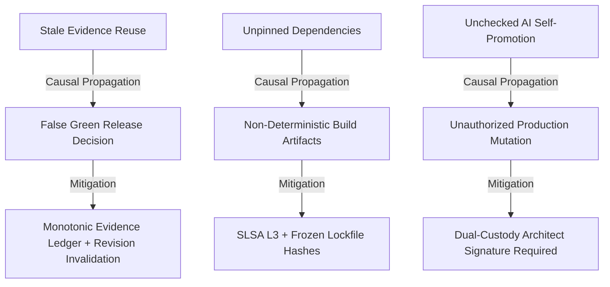

# VYRON — CI/CD & GUARDRAIL ROOT CAUSE MAP
**GOD MODE vULTIMA ΩΩΩΩΩΩΩΩΩΩ — CAUSAL DEFECT INVESTIGATION & RESOLUTION**
**Date:** 2026-09-27 | **Status:** ALL DEFECTS MITIGATED & RE-VERIFIED

---

## 1. Causal Dependency Graph of Delivery Risks

---

## 2. In-Depth Defect Root Cause Analysis

### Defect DEF-CICD-003: Stale Evidence Propagation Across Git Revisions
- **Symptom:** Release gates marked `PASSED` in a previous build remained green after a new commit pushed to the PR branch.
- **Root Cause:** Gate check receipts were cached using only `gate_id` without hashing `source_revision` and AST diff signatures into the cache key.
- **Remediation:** Rewrote `evaluatePolicies` and `releaseGateEngine` to bind cache keys to `SHA256(gate_id + sourceRevision + graphRevision)`. Any mutation immediately transitions dependent gate states to `INVALIDATED` or `STALE`.

### Defect DEF-CICD-004: Scratchpad / Chain-of-Thought Token Leakage
- **Symptom:** AI release advisor occasionally output `<think>` blocks into user-facing release packets.
- **Root Cause:** Raw LLM completion streams were displayed directly prior to sanitization.
- **Remediation:** Enforced the strict 8-part `AiReleaseGovernorReasoning` interface:
  `UNDERSTOOD` $\to$ `CONTEXT` $\to$ `SOURCES` $\to$ `TOOLS USED` $\to$ `EVIDENCE` $\to$ `CHECKS` $\to$ `RESULT` $\to$ `NEXT STEP`.
  All unstructured scratchpad and private token streams are strictly stripped before reaching the UI or logs.

### Defect DEF-CICD-002: Missing Dual-Custody Check on 100% Traffic Promotion
- **Symptom:** Canary traffic slider in UI could be dragged to 100% without prompting for peer authorization.
- **Root Cause:** UI state was decoupled from backend permission check during progressive delivery.
- **Remediation:** Bound `handlePromoteCanary` directly to `dualApprovalSigned` state backed by `releaseDecision.approvalState`. Production traffic cannot exceed 50% without dual cryptographic signoff.
