# VYRON — ROOT CAUSE & BLAST RADIUS FORENSIC MAP
## GOD MODE vULTIMA ΩΩΩΩ — ARCHITECTURAL DEFECT ANATOMY & FAULT DOMAIN ISOLATION

This document maps all identified architectural defects, risks, and blockers to their underlying structural root causes, fault domains, blast radiuses, and defensive perimeters across the 50-Phase Control Plane.

---

### 1. Root Cause Taxonomy & Fault Domains

```mermaid
graph TD
    subgraph FaultDomains [VYRON Architectural Fault Domains]
        FD1[1. Tooling & Build Environment]
        FD2[2. Third-Party Provider Lifecycle]
        FD3[3. Epistemic Status & Governance]
        FD4[4. Realtime State & Source-of-Truth]
        FD5[5. Multi-Tenant Identity & Authorization]
        FD6[6. Client UI React Lifecycle]
    end

    FD1 --> DEF001[DEF-001: ESLint Pattern Over-reach]
    FD1 --> DEF003[DEF-003: Absolute Path Leak]
    FD1 --> DEF006[DEF-006: Headless Browser Boundary]

    FD2 --> DEF004[DEF-004: Supabase Key Rotation Block]
    FD2 --> DEF005[DEF-005: Kaggle Credential Absence]
    FD2 --> DEF013[DEF-013: Webhook Delivery Degradation]

    FD3 --> DEF007[DEF-007: Binary Acceptance Collapse]
    FD3 --> DEF008[DEF-008: Untagged Simulation Predictions]
    FD3 --> DEF009[DEF-009: Phase/Dossier Parity Drift]
    FD3 --> DEF014[DEF-014: Detached Hash Proof]

    FD4 --> DEF010[DEF-010: Work Pulse Dual-Authority Risk]

    FD5 --> DEF011[DEF-011: Auto-Connect Privilege Escalation]
    FD5 --> DEF012[DEF-012: Cross-Tenant Handle Collision]

    FD6 --> DEF002[DEF-002: Copilot Action Dispatch Gap]
    FD6 --> DEF016[DEF-016: Synchronous setState in useEffect]
    FD6 --> DEF017[DEF-017: Missing Hook Dependency]
    FD6 --> DEF018[DEF-018: Polymorphic Adapter any Types]
```

---

### 2. Deep Forensic Root Cause Analysis

#### Category A: Architectural & Governance Boundaries (ULTRA-HIGH)
1. **DEF-010 (Work Pulse Source of Truth)**
   - **Root Cause**: Architectural anti-pattern where a realtime streaming sidebar (Work Pulse) maintains its own mutable state store rather than strictly subscribing as a read-only projection over the canonical event log.
   - **Blast Radius**: Split-brain truth condition between what the user sees in the event pulse vs what is persisted in PostgreSQL.
   - **Defensive Perimeter**: Unidirectional data flow. `WorkPulseSourceOfTruth` is restricted to consuming from `EventIngestionGateway` with 0 write methods to the primary database.

2. **DEF-011 (Auto-Connect Privilege Escalation)**
   - **Root Cause**: Linguistic and architectural ambiguity in "Auto-Connect" terminology. In an AI platform, automatic discovery of provider files (e.g. `lovable.dev`, `v0.dev`) must never automatically authorize network connection or token issuance.
   - **Blast Radius**: Silent account linkage, unauthorized data querying, and credential theft.
   - **Defensive Perimeter**: `providerDiscoveryEngine.ts` terminates at `USER_REVIEW_REQUIRED`. No connection token is minted without cryptographic human consent logged in `Consent & Authorization Ledger`.

3. **DEF-012 (Cross-Tenant Identity Collisions)**
   - **Root Cause**: Assuming external usernames (e.g. `github.com/octocat`) are globally unique within a multi-tenant enterprise system where multiple tenants may claim overlapping usernames or repositories.
   - **Blast Radius**: Inter-tenant data leakage, repository hijacking, and cross-project contamination.
   - **Defensive Perimeter**: Canonical identity correlation keys require tenant isolation: `${tenant_id}:${provider}:${external_id}`. Partition violations trigger security audit events.

---

#### Category B: Epistemic & Audit Integrity (HIGH)
4. **DEF-007 (Acceptance Semantics)**
   - **Root Cause**: Traditional binary CI mindset (Exit 0 = "VERIFIED") collapses complex multi-system states into a single boolean, falsely asserting full system readiness when cloud credentials are externally blocked.
   - **Defensive Perimeter**: 12-state epistemic model: `PASSED != VERIFIED`, `BLOCKED != PASSED`, `MOCK != LIVE`.

5. **DEF-008 & DEF-014 (Lineage & Evidence Detachment)**
   - **Root Cause**: Displaying predictions as facts and computing hashes without preserving the preimage payload and calculation recipe.
   - **Defensive Perimeter**: `[SIMULATION_RESULT / PREDICTION]` non-removable UI warning pills + SHA-256 pre-image bundling in `evidenceLedger.ts`.

---

#### Category C: External Provider Dependencies (HIGH / EXTERNALLY BLOCKED)
6. **DEF-004 & DEF-005 (Supabase & Kaggle External Blockers)**
   - **Root Cause**: External cloud credentials rotated or absent.
   - **Defensive Perimeter**: Graceful offline degradation with deterministic local mock database. Zero raw operational SQL across 636 scanned files. External state explicitly marked `EXTERNALLY_BLOCKED` rather than failing internal test gates.

---

#### Category D: Frontend Code Quality & React 19 Lint (LOW)
7. **DEF-016 & DEF-017 (Hook Dependencies & Initial Render Cascades)**
   - **Root Cause**: Legacy React 16/17 idiom calling `setState` inside `useEffect` for initial form draft hydration.
   - **Defensive Perimeter**: Triaged as low impact (<2ms initial mount delay). Scheduled for refactoring to lazy `useState` initializer in the next maintenance sprint.
