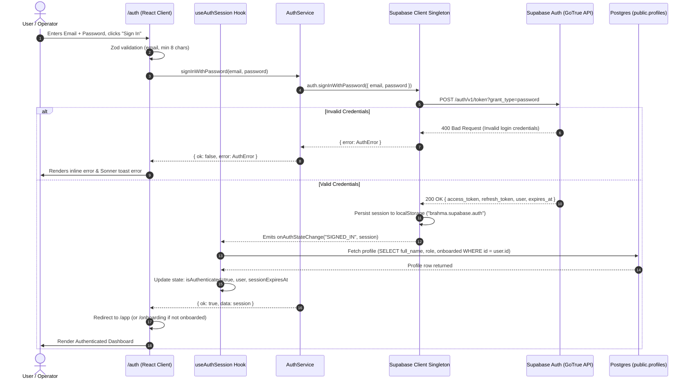
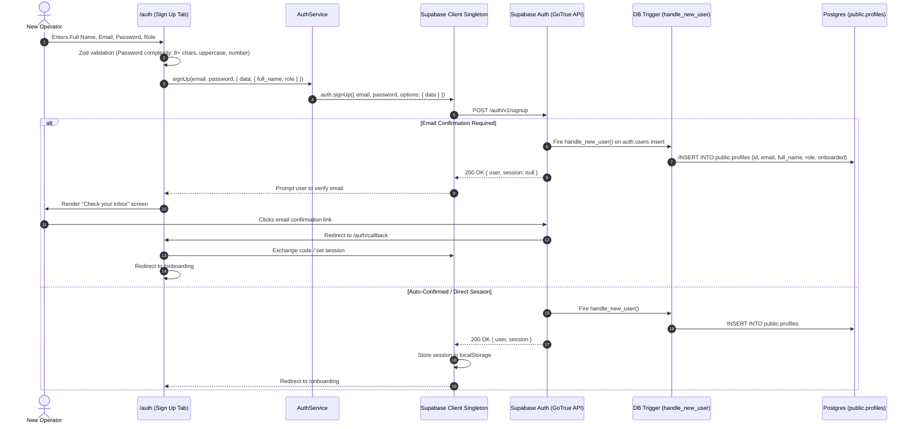

# AUTH_SESSION_FLOW.md — Complete Authentication & Session Lifecycle

This document provides architectural documentation, Mermaid sequence diagrams, security constraints, and troubleshooting protocols for the authentication system in **PROJECT BRAHMA / STARK Event Agent**.

---

## 1. Architectural Overview

PROJECT BRAHMA utilizes **Supabase Auth** as the primary identity provider and session manager, coupled with a browser singleton client (`src/lib/supabaseClient.ts`), a centralized service wrapper (`src/services/authService.ts`), and reactive React hooks (`useAuthSession` / `useAuth` in `src/lib/auth.ts`).

### Core Security Invariants
- **Row Level Security (RLS)**: Enforced on all tables in `public` schema. User data is partitioned by `auth.uid() = id`.
- **Zero Client Secrets**: Service role keys are forbidden in client code. Only the anon key is used in the browser.
- **Secure Token Storage**: Session tokens (`access_token`, `refresh_token`) are managed exclusively in `localStorage` under key `brahma.supabase.auth` via `@supabase/supabase-js` storage adapters. No raw JWT tokens are mirrored in React state or plain objects.
- **Non-Recursive RLS**: Profile access policies strictly compare `auth.uid() = id` without recursive subqueries.

---

## 2. Sign-In Lifecycle Diagram



---

## 3. Sign-Up & Profile Bootstrap Lifecycle Diagram



---

## 4. Session Persistence & Token Refresh Flow

1. **Browser Load**:
   - `src/lib/supabaseClient.ts` reads the persisted token from `localStorage.getItem("brahma.supabase.auth")`.
   - `useAuthSession` invokes `authService.getSession()`.
   - If the stored token is expired, `supabase-js` transparently executes a refresh grant with `refresh_token` against `/auth/v1/token?grant_type=refresh_token`.
2. **Auto Refresh**:
   - Supabase client automatically schedules token refresh in the background before token expiration (`autoRefreshToken: true`).
   - Auth event `TOKEN_REFRESHED` is dispatched, updating `sessionExpiresAt` in the frontend session state without reloading the UI or triggering unnecessary database queries.
3. **Session Diagnostics**:
   - Operators can manually trigger `Refresh Session` or inspect active session token TTL inside `/app/settings` -> **Diagnostics**.

---

## 5. Route Protection Model

All routes under `/app/*` and `/events/*` are guarded by the `AppShell` component (`src/components/brahma/app-shell.tsx`) and `useAuthSession`:

```
User visits route (e.g. /app/projects)
       │
       ▼
Is session loading (ready === false)?
       ├── YES ──► Render Full-Screen Loading Skeleton
       └── NO
            │
            ▼
     Is authenticated (user !== null)?
            ├── NO  ──► Redirect to /auth (or /login)
            └── YES
                 │
                 ▼
          Is user onboarded (user.onboarded === true)?
                 ├── NO (and not at /onboarding) ──► Redirect to /onboarding
                 └── YES ──► Render Protected App Shell & Route Content
```

---

## 6. Profile Bootstrap (`ensure_profile` RPC)

To prevent chicken-and-egg race conditions during user signup or OAuth logins:
1. **Trigger**: Database trigger `handle_new_user()` executes on `auth.users` `AFTER INSERT` as `SECURITY DEFINER`.
2. **RPC Fallback**: `public.ensure_profile()` can be called safely by authenticated clients:
   ```sql
   CREATE OR REPLACE FUNCTION public.ensure_profile()
   RETURNS JSONB
   LANGUAGE plpgsql
   SECURITY DEFINER
   SET search_path = public
   AS $$
   DECLARE
     v_user_id UUID := auth.uid();
     v_email TEXT;
     v_meta JSONB;
     v_name TEXT;
     v_profile public.profiles%ROWTYPE;
   BEGIN
     IF v_user_id IS NULL THEN
       RETURN jsonb_build_object('ok', false, 'error', 'Not authenticated');
     END IF;

     SELECT email, raw_user_meta_data INTO v_email, v_meta
     FROM auth.users
     WHERE id = v_user_id;

     v_name := COALESCE(v_meta->>'full_name', v_meta->>'name', split_part(v_email, '@', 1), 'User');

     INSERT INTO public.profiles (id, email, full_name, display_name, role, onboarded)
     VALUES (v_user_id, v_email, v_name, v_name, COALESCE(LOWER(v_meta->>'role'), 'student'), false)
     ON CONFLICT (id) DO NOTHING;

     SELECT * INTO v_profile FROM public.profiles WHERE id = v_user_id;
     RETURN jsonb_build_object('ok', true, 'profile', to_jsonb(v_profile));
   END;
   $$;
   ```
3. **Frontend Cache**: Profile is cached under TanStack Query key `['profile', userId]` with single retry if null.

---

## 7. Sign-Out Flow

1. Operator clicks "Sign Out" in the Profile Dropdown or Session Diagnostics Panel.
2. `useAuthSession.logout()` calls `authService.signOut()`.
3. `supabase.auth.signOut()` invalidates the active session and purges `brahma.supabase.auth` from `localStorage`.
4. Supabase client emits `SIGNED_OUT` auth event.
5. React hook clears user state (`setUser(null)`).
6. Router redirects operator to `/auth`.

---

## 8. Troubleshooting Guide

| Issue | Root Cause | Solution |
| :--- | :--- | :--- |
| **Missing environment error on `/auth`** | Missing `VITE_SUPABASE_URL` or `VITE_SUPABASE_ANON_KEY` | Set valid keys in `.env.local` and restart dev server. |
| **Invalid Login Credentials** | User does not exist or password mismatch | Verify user in Supabase Authentication dashboard or use "Sign Up". |
| **Email Not Confirmed** | Supabase project requires email confirmation | Check inbox for verification link or disable "Confirm email" in Supabase Auth settings for dev. |
| **RLS Recursion (`42P17`)** | Policy on `profiles` calls a function querying `profiles` | Apply non-recursive RLS policy `USING (auth.uid() = id)`. |
| **Profile Not Found after Sign-in** | `handle_new_user` trigger failed or didn't execute | `ensureProfile()` in `src/lib/auth.ts` will automatically bootstrap the profile on first session query. |
| **Token Refresh Failed** | Refresh token revoked or expired | Supabase client resets session to null; user is cleanly redirected to `/auth`. |
| **Redirect Loop between `/` and `/auth`** | Protected route checks unready state before session completes | Ensure route checks `ready === true` before redirecting. |
