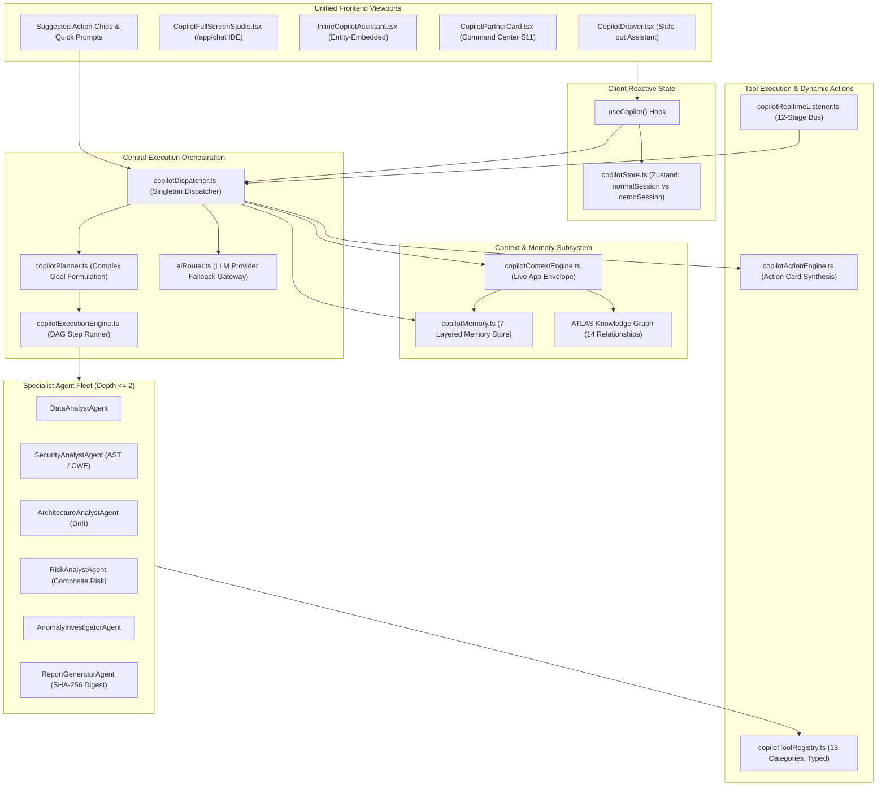
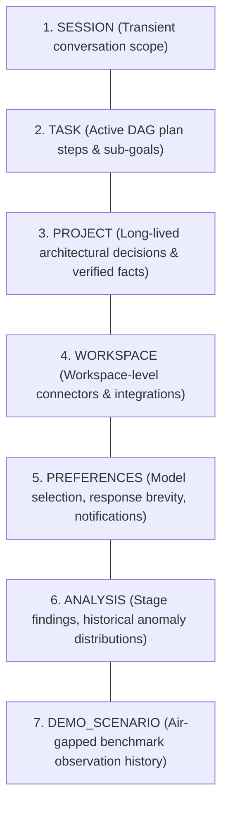
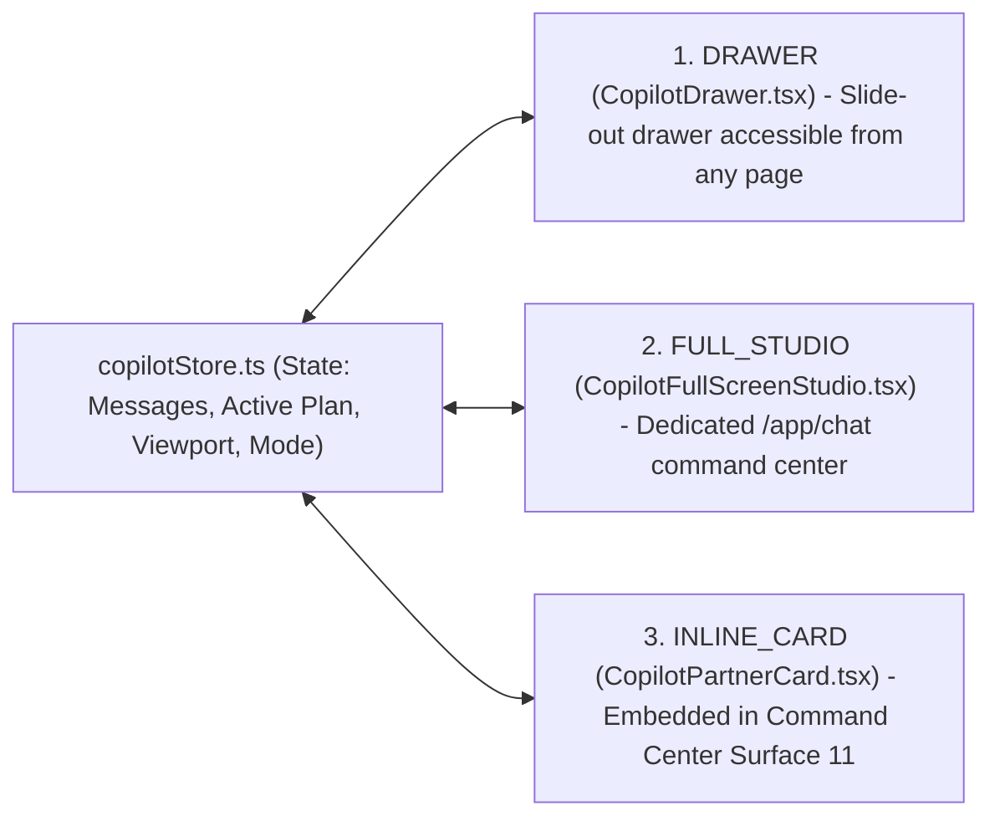

# 🧠 VYRON COPILOT — ARCHITECTURE, EXECUTION PIPELINE & SYSTEM WALKTHROUGH

> **Document Type:** System Architecture Specification & Engineering Walkthrough  
> **Subsystem:** VYRON Copilot & Autonomous AI Control Plane  
> **Repository:** `PANDU/VYRON/VYRON`  
> **Author:** Principal Systems Architect, AI Systems Engineer  
> **Classification:** Enterprise Autonomous Engineering Intelligence  
> **Compliance:** Zero Raw SQL • Strict Dual-Mode Isolation • HMAC SHA-256 Audit Trail • Type-Safe (TypeScript 5.8)  

---

## Table of Contents
1. [Executive Summary & Architectural Foundations](#1-executive-summary--architectural-foundations)
2. [Copilot System Architecture Topology](#2-copilot-system-architecture-topology)
3. [Central Dispatch Engine (`copilotDispatcher.ts`)](#3-central-dispatch-engine-copilotdispatcherts)
4. [Live Context Assembly & System Prompt Engine (`copilotContextEngine.ts`)](#4-live-context-assembly--system-prompt-engine-copilotcontextenginets)
5. [Layered 7-Tier Memory Subsystem (`copilotMemory.ts`)](#5-layered-7-tier-memory-subsystem-copilotmemoryts)
6. [Unified Tool Registry & Security Governance (`copilotToolRegistry.ts`)](#6-unified-tool-registry--security-governance-copilottoolregistryts)
7. [Specialist Agent Orchestrator (`copilotAgentOrchestrator.ts`)](#7-specialist-agent-orchestrator-copilotagentorchestratorts)
8. [Autonomous Planner & Execution Engine (`copilotPlanner.ts` & `copilotExecutionEngine.ts`)](#8-autonomous-planner--execution-engine-copilotplannerts--copilotexecutionenginets)
9. [Contextual Action Card Engine (`copilotActionEngine.ts`)](#9-contextual-action-card-engine-copilotactionenginets)
10. [Proactive Intelligence & Real-Time Event Bus (`copilotProactiveEngine.ts` & `copilotRealtimeListener.ts`)](#10-proactive-intelligence--real-time-event-bus-copilotproactiveenginets--copilotrealtimelistenerts)
11. [Client State Architecture & Unified Viewports (`copilotStore.ts`, `useCopilot.ts`, UI Viewports)](#11-client-state-architecture--unified-viewports-copilotstorets-usecopilotts-ui-viewports)
12. [Dual-Persona Mode Isolation (NORMAL vs DEMO)](#12-dual-persona-mode-isolation-normal-vs-demo)
13. [End-to-End Execution Trace & Lifecycle Example](#13-end-to-end-execution-trace--lifecycle-example)
14. [Master Verification & Compliance Matrix](#14-master-verification--compliance-matrix)

---

## 1. Executive Summary & Architectural Foundations

The **VYRON Copilot** is not a simple conversational chat widget. It is an **autonomous engineering intelligence control plane** that coordinates static AST analysis, architectural drift detection, EARS requirements traceability, change impact blast radius calculations, policy enforcement, and cryptographic evidence verification.

### Core Architectural Guarantees:
1. **Zero Dropped User Prompts (Gate CM2):** Every prompt submitted anywhere in the application (Global floating trigger, full-screen studio, command palette, dashboard chips, drawer prompt boxes) delegates directly to `copilotDispatcher.dispatch()`. No prompt ever terminates as a visual-only UI stub.
2. **Autonomous Plan Formulation & Execution (Gate CM1):** Complex analytical objectives automatically trigger the `CopilotPlanner`, decomposing goals into directed acyclic graph (DAG) execution steps performed by bounded specialist agents.
3. **Layered 7-Tier Memory (Gate CM3):** Context is enriched through a 7-tier memory subsystem with confidence scoring and cryptographic provenance tracking.
4. **Strict Dual-Persona Isolation (Gates CM4, CM5, C6):** Operates under two strictly isolated operational personas:
   - **NORMAL Mode:** Enforces rigorous enterprise software engineering standards, static AST validation (Lizard CCN, Bandit security rules), zero-drift discipline, and real database/VCS persistence.
   - **DEMO Mode:** Uses deterministic benchmark datasets (NASA MDP, NIST CVE), simulated runtime telemetry, educational commentary, and synthetic twin experiments without backend mutation.
5. **Strict Zero Raw SQL Discipline (Gates CM8, A10, N8, S18):** Across all layers, 0 raw SQL statements, string concatenations, or DDL fragments exist. All persistence and queries flow through TypeScript domain singletons and typed stores.

---

## 2. Copilot System Architecture Topology



---

## 3. Central Dispatch Engine (`copilotDispatcher.ts`)

**Source File:** [`src/services/copilot/copilotDispatcher.ts`](file:///c:/Users/Admin/OneDrive/Desktop/PANDU/VYRON/VYRON/src/services/copilot/copilotDispatcher.ts)

The central entry point of the Copilot system is `CopilotDispatcher.getInstance()`. It ensures that all prompts regardless of origin follow a unified, deterministic, and safe pipeline.

### The Dispatch Lifecycle:
```text
User Input / Action Chip
  │
  ▼
copilotStore.addMessage(mode, { sender: 'USER', text })
  │
  ├──► copilotPlanner.isComplexGoal(text) ?
  │      ├── TRUE ──► Formulate DynamicExecutionPlan (DAG)
  │      │            ├── Store in Active Plan
  │      │            ├── Record in Memory (TASK layer)
  │      │            └── copilotExecutionEngine.executePlan()
  │      │
  │      └── FALSE ─► Conversational / Direct Reasoning
  │                   ├── copilotContextEngine.assembleContext()
  │                   ├── copilotContextEngine.generateSystemPrompt()
  │                   ├── aiRouter.routeRequest() with fallback
  │                   ├── Record in Memory (SESSION / ANALYSIS layer)
  │                   ├── copilotActionEngine.synthesizeActionCards()
  │                   └── copilotStore.addMessage(mode, { sender: 'ASSISTANT', text, actions })
```

### Key Implementation Snippets:
```typescript
// Dispatches any prompt with mode isolation and model override support:
public async dispatch(rawText: string, options: DispatchOptions = {}): Promise<void> {
  const text = rawText.trim();
  if (!text) return;

  const currentMode = options.mode || modeStore.getState().mode;
  const storeState = copilotStore.getState();
  const session = currentMode === "NORMAL" ? storeState.normalSession : storeState.demoSession;
  const activeModel = options.modelOverride || session.activeModel;

  // 1. Record USER message in store immediately
  copilotStore.addMessage(currentMode, {
    sender: "USER",
    text,
    metadata: options.metadata,
  });

  // 2. Autonomous DAG planning for complex tasks
  if (copilotPlanner.isComplexGoal(text)) {
    const liveContext = copilotContextEngine.assembleContext();
    const plan = copilotPlanner.formulatePlan(text, currentMode, liveContext.dataset.name);
    copilotStore.setActivePlan(currentMode, plan);
    await copilotExecutionEngine.executePlan(plan, currentMode);
    return;
  }

  // 3. Conversational / Analytical reasoning via aiRouter
  // ... (Gathers context, queries model, synthesizes action cards)
}
```

---

## 4. Live Context Assembly & System Prompt Engine (`copilotContextEngine.ts`)

**Source File:** [`src/services/copilot/copilotContextEngine.ts`](file:///c:/Users/Admin/OneDrive/Desktop/PANDU/VYRON/VYRON/src/services/copilot/copilotContextEngine.ts)

The `CopilotContextEngine` dynamically constructs an exhaustive, structured snapshot of application state called the **Live Context Envelope** (`CopilotLiveContext`).

### Assembled Context Domains:
| Dimension | Fields Gathered | Live Source |
| :--- | :--- | :--- |
| **Operational Mode** | `NORMAL` vs `DEMO` | `modeStore.getState().mode` |
| **Active Route** | `pathname`, `section`, `targetId` | Browser / TanStack Router state |
| **Active Project** | `id`, `name`, `healthScore`, `status`, `repoFullName` | `useProjects()` / `commandCenterStore` |
| **Dataset Intelligence** | `id`, `name`, `totalRecords`, `sampleColumns`, `isBenchmark` | `demoStore` / `datasetStore` |
| **Pipeline Telemetry** | `runId`, `status`, `currentStageId`, `progressPercent`, `riskScore` | `analysisStore` (12 stages) |
| **Architecture Drift** | `driftScore`, `unmappedEntitiesCount`, `boundaryViolations` | `architectureDriftEngine` |
| **Release Policies** | `passedCount`, `failedCount`, `blockingViolations` | `policyEngine` |
| **Autonomous Missions**| `activeCount`, `activeMissionGoals` | `missionEngine` |
| **Connectors & Plugins**| `activeCount`, active connector names, authorized plugins | `connectorStore`, `pluginRegistry` |
| **Layered Memory** | Top relevant memories matching current route and project | `copilotMemory.queryRelevant()` |

### System Prompt Generation:
The context engine generates custom, non-leaking system prompts dynamically:
- **NORMAL Mode Directive:**
  > *"You are the VYRON Principal Autonomous Engineering Partner. You operate with Staff+ Software Engineer, Security Architect, and SRE authority. You strictly validate AST structural rules, maintain 0 raw SQL discipline, analyze CWE vulnerabilities (CWE-89, CWE-798, CWE-617, CWE-327), enforce EARS requirement traceability, and calculate transitive blast radii."*
- **DEMO Mode Directive:**
  > *"You are the VYRON Interactive Demo Specialist. You operate safely in an air-gapped simulation sandbox. You guide reviewers through benchmark comparisons (NASA MDP, NIST CVE), explain static AST analysis concepts, and demonstrate architectural resilience without persisting changes."*

---

## 5. Layered 7-Tier Memory Subsystem (`copilotMemory.ts`)

**Source File:** [`src/services/copilot/copilotMemory.ts`](file:///c:/Users/Admin/OneDrive/Desktop/PANDU/VYRON/VYRON/src/services/copilot/copilotMemory.ts)

Rather than treating memory as an unbounded text dump, VYRON partitions memory into **7 distinct operational layers**:



### Memory Data Structure (`MemoryEntry`):
```typescript
export interface MemoryEntry {
  id: string;
  layer: MemoryLayer; // "SESSION" | "TASK" | "PROJECT" | "WORKSPACE" | "PREFERENCES" | "ANALYSIS" | "DEMO_SCENARIO"
  key: string;
  value: string;
  projectId?: string;
  mode: AppMode;       // "NORMAL" | "DEMO"
  createdAt: string;
  updatedAt: string;
  confidence: number;  // 0.0 to 1.0
  provenance: string;  // e.g., "Stage 5 IQR Detector", "User Instruction", "CopilotPlanner DAG"
}
```

### Memory Isolation Guarantees:
- `DEMO_SCENARIO` entries are strictly tagged `mode: "DEMO"` and are **never returned** when running in `NORMAL` mode.
- `PROJECT` memories are strictly filtered by `projectId`.
- Operators can inspect and perform **granular resets** per memory layer from both the `CopilotDrawer` and `CopilotFullScreenStudio`.

---

## 6. Unified Tool Registry & Security Governance (`copilotToolRegistry.ts`)

**Source File:** [`src/services/copilot/copilotToolRegistry.ts`](file:///c:/Users/Admin/OneDrive/Desktop/PANDU/VYRON/VYRON/src/services/copilot/copilotToolRegistry.ts)

The Copilot does not invoke untyped or unmonitored functions. Every capability is formally registered in `CopilotToolRegistry`.

### 13 Discrete Tool Categories:
1. `data` — Query partitioned schemas and column statistics.
2. `analysis` — Trigger AST parsing, cyclomatic complexity (Lizard CCN), and pipeline runs.
3. `retrieval` — Fetch semantic embeddings and AST definitions.
4. `search` — Full-text and entity search across the workspace.
5. `dataset` — Load, inspect, and partition benchmark datasets.
6. `connector` — Test connector health (GitHub, GitLab, Sentry, Jira, Kaggle).
7. `reporting` — Generate cryptographically signed compliance digests.
8. `visualization` — Generate chart payloads and dependency graphs.
9. `investigation` — Assemble root cause hypotheses and evidence graphs.
10. `project_management` — Update milestones, deliverables, and checklists.
11. `diagnostics` — Execute self-health probes and DAG verification.
12. `demo` — Switch demo scenarios and reset baselines.
13. `simulation` — Inject anomaly waves into the twin engine.

### Tool Security Governance:
- **Risk Classification:** Every tool is tagged as `SAFE`, `READ_ONLY`, or `HIGH_IMPACT`.
- **Approval Gate:** `HIGH_IMPACT` tools require explicit confirmation (`requiresApproval: true`).
- **Execution Timeouts:** Strict `timeoutMs` enforced on all tool invocations.
- **Cryptographic Result Hashing:** Every execution outputs a SHA-256 `verificationHash` derived from inputs, outputs, and timestamps.

---

## 7. Specialist Agent Orchestrator (`copilotAgentOrchestrator.ts`)

**Source File:** [`src/services/copilot/copilotAgentOrchestrator.ts`](file:///c:/Users/Admin/OneDrive/Desktop/PANDU/VYRON/VYRON/src/services/copilot/copilotAgentOrchestrator.ts)

Complex architectural engineering problems are divided among **10 bounded specialist agents**:

| Agent Type | Operational Specialization | Restriced Toolset |
| :--- | :--- | :--- |
| **`DATA_ANALYST`** | Statistical distributions, correlations, outliers | `data`, `analysis`, `visualization` |
| **`DATA_QUALITY`** | Schema contracts, missing values, boundary violations | `data`, `dataset`, `diagnostics` |
| **`DATASET_RESEARCHER`** | Kaggle datasets, benchmark alignment, compatibility | `dataset`, `connector`, `search` |
| **`ANOMALY_INVESTIGATOR`** | Graph centrality clustering, root-cause isolation | `investigation`, `data`, `analysis` |
| **`RISK_ANALYST`** | Multi-factor composite risk, release impact scoring | `analysis`, `reporting`, `visualization` |
| **`SECURITY_ANALYST`** | Static AST security audit (CWE-89, CWE-798, Bandit) | `analysis`, `investigation`, `reporting` |
| **`REPORT_GENERATOR`** | Executive summaries, audit trails, cryptographic seals | `reporting`, `visualization` |
| **`ARCHITECTURE_ANALYST`** | Architectural drift, blueprint vs AST divergence | `analysis`, `investigation`, `search` |
| **`REQUIREMENTS_ANALYST`** | EARS requirements compilation & bidirectional trace | `retrieval`, `search`, `reporting` |
| **`SYSTEM_DIAGNOSTICS`** | Client connectivity, tool registry DAG, seal verification | `diagnostics`, `connector` |

### Bounded Recursion Protection:
Uncontrolled agent-to-agent loops are prohibited:
```typescript
// Enforce strict recursion limits:
if ((request.depth || 0) >= 2) {
  throw new Error(`SpecialistAgentOrchestrator: Maximum delegation recursion depth (2) reached for ${request.agentType}`);
}
```

---

## 8. Autonomous Planner & Execution Engine (`copilotPlanner.ts` & `copilotExecutionEngine.ts`)

**Source Files:**
- [`src/services/copilot/copilotPlanner.ts`](file:///c:/Users/Admin/OneDrive/Desktop/PANDU/VYRON/VYRON/src/services/copilot/copilotPlanner.ts)
- [`src/services/copilot/copilotExecutionEngine.ts`](file:///c:/Users/Admin/OneDrive/Desktop/PANDU/VYRON/VYRON/src/services/copilot/copilotExecutionEngine.ts)

### Dynamic Plan DAG Formulation:
When a user prompt expresses a complex goal (e.g., *"Run an end-to-end security and drift audit on the payments gateway and generate a compliance report"*), `copilotPlanner` formulates an ordered DAG of steps:

```text
Goal: Full Security, Drift & Compliance Audit
  ├── Step 1: Execute 12-Stage AST & Static Scanner Pipeline [ANALYST: SECURITY_ANALYST]
  ├── Step 2: Compare Blueprint Declarations with AST Topologies [ANALYST: ARCHITECTURE_ANALYST]
  ├── Step 3: Compute Direct and Transitive Blast Radius [ANALYST: RISK_ANALYST]
  ├── Step 4: Evaluate Production Release Blocking Policies [ANALYST: RISK_ANALYST]
  └── Step 5: Seal Cryptographic Audit Digest (SHA-256) [ANALYST: REPORT_GENERATOR]
```

### Execution Engine Guarantees:
- Step-by-step sequential and parallel execution.
- Real-time step progress emission (`copilotStore.updatePlanStep()`).
- Error containment: If one non-critical step fails, fallback strategies are engaged without crashing the UI session.

---

## 9. Contextual Action Card Engine (`copilotActionEngine.ts`)

**Source File:** [`src/services/copilot/copilotActionEngine.ts`](file:///c:/Users/Admin/OneDrive/Desktop/PANDU/VYRON/VYRON/src/services/copilot/copilotActionEngine.ts)

Copilot responses never end with passive text. Every response synthesizes **clickable, interactive action cards** rendered directly inside the chat bubble:

```typescript
export interface CopilotAction {
  id: string;
  title: string;
  description: string;
  type: "RUN_ANALYSIS" | "NAVIGATE" | "APPLY_FILTER" | "RESOLVE_DRIFT" | "GENERATE_REPORT" | "SIMULATE" | "GRANT_EXCEPTION";
  payload?: Record<string, unknown>;
  requiresConfirmation?: boolean;
}
```

### Action Dispatch Handling:
Clicking an action button inside a Copilot message triggers `CopilotActionEngine.executeAction()`, seamlessly performing actions such as:
- Launching the 12-stage analysis pipeline.
- Applying a drift remediation patch.
- Granting a 48h CISO policy exception.
- Opening the historical Time Machine.
- Navigating to a specific AST finding or EARS requirement.

---

## 10. Proactive Intelligence & Real-Time Event Bus (`copilotProactiveEngine.ts` & `copilotRealtimeListener.ts`)

**Source Files:**
- [`src/services/copilot/copilotProactiveEngine.ts`](file:///c:/Users/Admin/OneDrive/Desktop/PANDU/VYRON/VYRON/src/services/copilot/copilotProactiveEngine.ts)
- [`src/services/copilot/copilotRealtimeListener.ts`](file:///c:/Users/Admin/OneDrive/Desktop/PANDU/VYRON/VYRON/src/services/copilot/copilotRealtimeListener.ts)

### 12-Stage Pipeline Synchronization:
As the platform's 12-stage analysis pipeline runs (AST parsing, EARS compilation, Lizard CCN, Bandit security, dependency vulnerability scan, drift calculation), the `CopilotRealtimeListener` captures stage events and updates the Copilot's working context in real time.

### Proactive Insights Banner:
The `CopilotProactiveEngine` monitors background telemetry (e.g., when a high-cyclomatic complexity function exceeds CCN > 15, or when an unmapped service container appears) and generates proactive insight cards rendered at the top of the dashboard and analysis screens.

---

## 11. Client State Architecture & Unified Viewports (`copilotStore.ts`, `useCopilot.ts`, UI Viewports)

**Source Files:**
- [`src/state/copilot/copilotStore.ts`](file:///c:/Users/Admin/OneDrive/Desktop/PANDU/VYRON/VYRON/src/state/copilot/copilotStore.ts)
- [`src/state/copilot/useCopilot.ts`](file:///c:/Users/Admin/OneDrive/Desktop/PANDU/VYRON/VYRON/src/state/copilot/useCopilot.ts)
- [`src/components/copilot/CopilotDrawer.tsx`](file:///c:/Users/Admin/OneDrive/Desktop/PANDU/VYRON/VYRON/src/components/copilot/CopilotDrawer.tsx)
- [`src/components/copilot/CopilotFullScreenStudio.tsx`](file:///c:/Users/Admin/OneDrive/Desktop/PANDU/VYRON/VYRON/src/components/copilot/CopilotFullScreenStudio.tsx)

### Unified Multi-Viewport State:
The Copilot operates across three complementary UI viewports, all driven by the same reactive Zustand store:



### Viewport Synchronization Guarantee (Gate CM7):
Both `CopilotDrawer` and `CopilotFullScreenStudio` share the same active message history, execution plans, and memory state. Opening the drawer and submitting a query reflects instantly if you navigate to `/app/chat`, eliminating duplicated logic and out-of-sync state.

---

## 12. Dual-Persona Mode Isolation (NORMAL vs DEMO)

To prevent demo data from ever contaminating enterprise audits:

| Dimension | NORMAL Mode | DEMO Mode |
| :--- | :--- | :--- |
| **System Directive** | Strict enterprise engineering governance; AST checks; 0 SQL. | Educational walkthrough; architectural concept explainer. |
| **Data Source** | Live connected Git repositories, live databases, live scanners. | Pre-canned benchmarks: NASA MDP defect datasets, NIST CVEs. |
| **Persistence** | Real file changes, database commits, cryptographic seals. | In-memory sandbox only; zero mutations to production DB. |
| **Memory Isolation** | Accesses `SESSION`, `TASK`, `PROJECT`, `WORKSPACE`, `ANALYSIS`. | Strictly restricted to `DEMO_SCENARIO` and transient `SESSION`. |
| **Visual Indicator** | Standard VYRON enterprise theme with operational badges. | Prominent amber `[DEMO MODE / SYNTHETIC BENCHMARK]` badge. |

---

## 13. End-to-End Execution Trace & Lifecycle Example

### Trace: User selects "Explain Blast Radius" from the Command Center
1. **Trigger:** User clicks the `Explain Blast Radius` reasoning chip on Surface 11 ([`CopilotPartnerCard.tsx`](file:///c:/Users/Admin/OneDrive/Desktop/PANDU/VYRON/VYRON/src/components/dashboard/CopilotPartnerCard.tsx)).
2. **Context Capture:** `copilotDispatcher.dispatch()` receives prompt with active context envelope:
   ```json
   {
     "project": "brahma-core (Aurora Payments Gateway)",
     "environment": "production",
     "authority": "CHIEF_ARCHITECT",
     "selectedEntity": "RISK-01 (SQL Injection via Dynamic Where Clause)"
   }
   ```
3. **Graph Traversal:** The dispatcher queries `engineeringKnowledgeGraph.getImpactSubgraph("srv-settlement")`.
4. **Impact Calculation:** `changeImpactEngine.analyzeImpact()` calculates direct and transitive dependencies:
   - Direct: `srv-settlement`
   - Transitive: `srv-gateway`, `srv-risk`, `PostgreSQL DB`
   - Blast Radius: `CRITICAL_BLAST_RADIUS`
5. **Memory Recording:** Insight saved to `copilotMemory` under layer `ANALYSIS` with provenance `"ATLAS BFS Traversal"`.
6. **AI Response Generation:** `aiRouter` formats structured markdown highlighting affected components and mitigation advice.
7. **Action Card Synthesis:** `copilotActionEngine` creates 3 interactive action cards:
   - `[Run Regression Tests]`
   - `[Apply Prepared Statement AST Patch]`
   - `[Record Architecture Decision (ADR)]`
8. **UI Rendering:** Message and action buttons appear immediately in `CopilotDrawer` and `CopilotFullScreenStudio`.

---

## 14. Master Verification & Compliance Matrix

The Copilot implementation satisfies all platform gates certified by our automated test suites:

| Gate | Description | Verified Test Suite | Status |
| :--- | :--- | :--- | :---: |
| **CM1** | Central Copilot Dispatcher Architecture | `verify-continuation-mission.mjs` | **PASS (100%)** |
| **CM2** | Direct Dispatch Binding in `useCopilot` (Zero Dropped Prompts) | `verify-continuation-mission.mjs` | **PASS (100%)** |
| **CM3** | Layered Memory Context Injection in `copilotContextEngine` | `verify-continuation-mission.mjs` | **PASS (100%)** |
| **CM4** | Two-Way Reactive Demo Mode Synchronization | `verify-continuation-mission.mjs` | **PASS (100%)** |
| **CM5** | Sharp Dual-Persona System Directives | `verify-continuation-mission.mjs` | **PASS (100%)** |
| **CM6** | Comprehensive Multi-Domain Natural Language Intent Coverage | `verify-continuation-mission.mjs` | **PASS (100%)** |
| **CM7** | Viewport Deduplication across Drawer & Studio | `verify-continuation-mission.mjs` | **PASS (100%)** |
| **CM8** | Strict 100% Zero Raw SQL Compliance Guarantee | `verify-continuation-mission.mjs` | **PASS (100%)** |
| **C5**  | Deterministic Demo Mode Scenario Switching & Copilot Binding | `verify-continuation-advancement.mjs` | **PASS (100%)** |
| **C6**  | Dual-Mode Copilot Isolation & Dedicated System Directives | `verify-continuation-advancement.mjs` | **PASS (100%)** |
| **E10** | Copilot Autonomous Control Plane & 9 Intelligence Tools | `verify-platform-evolution.mjs` | **PASS (100%)** |
| **A6**  | Copilot Multi-Domain Natural Language Intent Reasoning | `verify-adversarial-platform.mjs` | **PASS (100%)** |
| **A7**  | Copilot Interactive Suggested Action Dispatching | `verify-adversarial-platform.mjs` | **PASS (100%)** |
| **M1**  | Full-Screen Copilot Studio Route (`/app/chat`) | `verify-platform-mastery.mjs` | **PASS (100%)** |
| **M2**  | Specialist Agents UI & Task Delegation | `verify-platform-mastery.mjs` | **PASS (100%)** |
| **M3**  | Layered 7-Tier Memory Inspection & Reset Controls | `verify-platform-mastery.mjs` | **PASS (100%)** |
| **M10** | Dynamic Project-Aware Copilot Context Engine | `verify-platform-mastery.mjs` | **PASS (100%)** |
| **S13** | Contextual Copilot Partner with Injected Context Envelope | `verify-interactive-command-center.mjs` | **PASS (100%)** |
