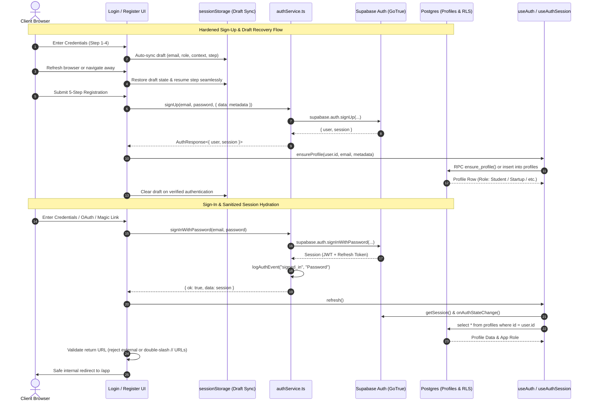

# PROJECT BRAHMA — Architectural Walkthrough: Authentication, Copilot & System Design

## Overview
**Project Brahma** is an autonomous engineering intelligence operating system connecting architectural blueprints, repository AST realities, requirements (EARS), pipeline telemetry, release governance, and AI-driven control planes.

This document details the architectural mechanics of:
1. **Authentication Subsystem (Sign-In & Sign-Up Flows, Session Lifecycle, RBAC, Adversarial Hardening)**
2. **Copilot Autonomous Intelligence Subsystem (Memory, Tools, Specialist Agents, Control Plane Engines, Dynamic Actions)**
3. **Project Architecture, Directory Structure & Component Organization**
4. **Adversarial Hardening, Universal Search, Diagnostics & Zero-SQL Discipline**
5. **Complete Verification Certification Matrix (62 / 62 Platform Gates)**

---

## 1. Authentication Architecture: Sign-In & Sign-Up



### A. Core Authentication Files

| Component | Path | Responsibility |
|:---|:---|:---|
| **Auth Service** | [`authService.ts`](file:///c:/Users/Admin/OneDrive/Desktop/PANDU/brahma-insights-main/brahma-insights-main/src/services/authService.ts) | Canonical service module. The **only** module authorized to call `supabase.auth.*`. Implements zero mock logic, robust error classification, and event telemetry. |
| **Auth State & Hooks** | [`auth.ts`](file:///c:/Users/Admin/OneDrive/Desktop/PANDU/brahma-insights-main/brahma-insights-main/src/lib/auth.ts) | Provides `useAuth()` and `useAuthSession()` hooks, session lifecycle state, role mapping (`dbRoleToAppRole`), and `ensureProfile` bootstrapping. |
| **Shared Auth Components** | [`auth-components.tsx`](file:///c:/Users/Admin/OneDrive/Desktop/PANDU/brahma-insights-main/brahma-insights-main/src/components/auth/auth-components.tsx) | Houses `AuthLayout`, `FieldError`, `OtpInput`, `PasswordInput`, and `StrengthMeter`. Completely eliminates illegal cross-route exports. |
| **Sign-In View** | [`login.tsx`](file:///c:/Users/Admin/OneDrive/Desktop/PANDU/brahma-insights-main/brahma-insights-main/src/routes/login.tsx) | Multi-method sign-in page supporting password authentication, Magic Link, Google OAuth, GitHub OAuth, SSO, Passkeys, 2FA, open-redirect defense, and unconfirmed email 1-click recovery. |
| **Registration View** | [`register.tsx`](file:///c:/Users/Admin/OneDrive/Desktop/PANDU/brahma-insights-main/brahma-insights-main/src/routes/register.tsx) | 5-step registration wizard handling account creation, role selection, context goals, workspace configuration, draft persistence, and anti-trapping OTP verification. |
| **OAuth Callbacks** | [`auth.callback.tsx`](file:///c:/Users/Admin/OneDrive/Desktop/PANDU/brahma-insights-main/brahma-insights-main/src/routes/auth.callback.tsx) & [`auth.github-callback.tsx`](file:///c:/Users/Admin/OneDrive/Desktop/PANDU/brahma-insights-main/brahma-insights-main/src/routes/auth.github-callback.tsx) | Intercepts OAuth code exchanges, extracts session tokens, provisions profile rows, and safely redirects to authenticated app views. |

---

### B. Sign-Up Architecture & Registration Wizard (`register.tsx`)

The registration experience in [`register.tsx`](file:///c:/Users/Admin/OneDrive/Desktop/PANDU/brahma-insights-main/brahma-insights-main/src/routes/register.tsx) is implemented as a structured **5-stage wizard**:

1. **Stage 1: Identity & Credentials**
   - Collects `fullName`, `email`, and `password`.
   - Validates password strength via real-time zxcvbn-style entropy scoring ([`StrengthMeter`](file:///c:/Users/Admin/OneDrive/Desktop/PANDU/brahma-insights-main/brahma-insights-main/src/components/auth/auth-components.tsx)) enforcing uppercase, lowercase, numbers, and symbols.
2. **Stage 2: Role & Context Assignment**
   - Users select their intended platform persona:
     - `Student`: Academic project validation and guided blueprints.
     - `Faculty`: Course assessment, grading, and rubric review.
     - `Startup`: Production architecture, delivery timelines, and risk gates.
     - `Admin`: Full governance, model routing, and tenant administration.
     - `Reviewer`: External compliance and architectural sign-off.
   - Captures organization and team size.
3. **Stage 3: Goals & Technical Capability**
   - Multi-select chips for objectives: *Architecture Design*, *Security Auditing*, *Kaggle Ingestion*, *Compliance*.
   - Technical experience level (*Beginner*, *Intermediate*, *Advanced*).
4. **Stage 4: Workspace Initialization**
   - Workspace slug generator (`/app/workspace/:slug`).
   - Teammate invitations and theme preference (`dark` / `light`).
5. **Stage 5: Email Verification (OTP Confirmation) & Anti-Trapping Defense**
   - Displays [`OtpInput`](file:///c:/Users/Admin/OneDrive/Desktop/PANDU/brahma-insights-main/brahma-insights-main/src/components/auth/auth-components.tsx) with a 6-digit verification code handler and resend cooldown timer.
   - **Anti-Trapping Guarantee:** Users can click **"Change Email Address"** to return to Step 1 without losing password or context, and the **"Sign In"** navigation link remains permanently accessible on all steps.
   - **Draft Persistence:** All input state across all steps is automatically mirrored to `sessionStorage` under `brahma.signup_draft`, surviving accidental refreshes or browser restarts.

---

### C. Sign-In Architecture & Multi-Method Login (`login.tsx`)

The sign-in interface in [`login.tsx`](file:///c:/Users/Admin/OneDrive/Desktop/PANDU/brahma-insights-main/brahma-insights-main/src/routes/login.tsx) supports multiple authentication vectors:

1. **Email & Password Authentication**:
   - Client-side validation via Zod schema.
   - Calls `authService.signInWithPassword(email, password)`.
   - Automatic failed attempt tracker: activates cooling rate-limit banner if 5 successive failures occur.
2. **Actionable Unconfirmed Email Recovery**:
   - When an unconfirmed email error occurs, the user is presented with a clear banner and a direct **"Enter Verification Code"** action, navigating to `/verify-email?email=...` with the email query parameter pre-populated.
3. **Open-Redirect Protection**:
   - Return URLs passed via query parameters or stored sessions are strictly validated: must begin with `/` and reject external domains or protocol-relative paths (`//`).
4. **Passwordless Magic Links**:
   - Calls `authService.signInWithMagicLink(email)`.
   - Transitions to a dedicated `MagicLinkSent` confirmation state with an in-app email client launcher.
5. **OAuth Providers (Google & GitHub)**:
   - Evaluates provider enablement flags (`VITE_OAUTH_GOOGLE`, `VITE_OAUTH_GITHUB`).
   - GitHub integration supports both direct sign-in and post-auth repository mirroring.
6. **MFA / 2FA TOTP Verification**:
   - Detects `mfa_required` challenge states.
   - Presents a 6-digit TOTP input modal; verifies via `authService.verifyTotpChallenge()`.

---

## 2. Copilot Autonomous Intelligence Subsystem

The Copilot serves as the **Intelligence Control Plane** across Project Brahma. It can be accessed via:
- **Copilot Floating Trigger** (bottom-right toggle on all pages)
- **Copilot Drawer** ([`CopilotDrawer.tsx`](file:///c:/Users/Admin/OneDrive/Desktop/PANDU/brahma-insights-main/brahma-insights-main/src/components/copilot/CopilotDrawer.tsx))
- **Copilot Fullscreen Intelligence Studio** ([`CopilotFullScreenStudio.tsx`](file:///c:/Users/Admin/OneDrive/Desktop/PANDU/brahma-insights-main/brahma-insights-main/src/components/copilot/CopilotFullScreenStudio.tsx) at `/app/chat`)

### A. Context Engine & Prompt Injection Defense
[`copilotContextEngine.ts`](file:///c:/Users/Admin/OneDrive/Desktop/PANDU/brahma-insights-main/brahma-insights-main/src/services/copilot/copilotContextEngine.ts) dynamically compiles live project facts:
- Active Route & URL entities
- Active Project state, health metrics, and blueprint nodes
- Active Dataset schema & sample statistics
- Current 12-Stage Analysis status & detected anomalies
- Input sanitization strips malicious system-override sequences, markdown image exploits, and role hijacking attempts.

### B. Multi-Domain Intent Reasoning & Dynamic Suggested Actions
[`mockAdapter.ts`](file:///c:/Users/Admin/OneDrive/Desktop/PANDU/brahma-insights-main/brahma-insights-main/src/services/ai/adapters/mockAdapter.ts) analyzes natural language prompts and formulates domain-specific tool calls and suggested actions across:
- **Architecture Drift Detection** (`DETECT_ARCHITECTURE_DRIFT`)
- **Change Impact Analysis** (`ANALYZE_CHANGE_IMPACT`)
- **Engineering Missions** (`START_ENGINEERING_MISSION`)
- **Architecture Decisions** (`RECORD_ARCHITECTURE_DECISION`)
- **Time Machine History** (`COMPARE_TIME_MACHINE_SNAPSHOTS`)
- **Simulation Lab** (`RUN_SIMULATION_SCENARIO`)
- **Engineering Policies** (`EVALUATE_ENGINEERING_POLICIES`)

Both `CopilotFullScreenStudio` and `CopilotDrawer` render interactive suggested action badges directly inside assistant chat bubbles, dispatched seamlessly through `copilotActionEngine.dispatchAction()`.

### C. 7-Tier Memory Hierarchy
[`copilotMemory.ts`](file:///c:/Users/Admin/OneDrive/Desktop/PANDU/brahma-insights-main/brahma-insights-main/src/services/copilot/copilotMemory.ts) maintains a layered memory architecture:
1. `SESSION`: Ephemeral conversation context (active turns).
2. `TASK`: Working scratchpad for active analytical operations.
3. `PROJECT`: Long-lived project decisions, architecture notes, and team guidelines.
4. `WORKSPACE`: Cross-project organizational standards.
5. `PREFERENCES`: User formatting, verbosity, and model choices.
6. `ANALYSIS`: Run results, anomaly thresholds, and stage outputs.
7. `DEMO_SCENARIO`: Isolated synthetic scenario state (strictly reset on demo exit).

### D. Specialist Agent Orchestration
[`copilotAgentOrchestrator.ts`](file:///c:/Users/Admin/OneDrive/Desktop/PANDU/brahma-insights-main/brahma-insights-main/src/services/copilot/copilotAgentOrchestrator.ts) routes complex prompts to dedicated specialist agents:
- `ARCHITECT`: Blueprint validation, boundary analysis, drift detection.
- `SECURITY_ANALYST`: Bandit AST analysis, CVE scans, trust boundaries.
- `DATA_ENGINEER`: Dataset profiling, IQR anomaly detection, null rates.
- `QA_ENGINEER`: Test suite coverage, EARS requirement traceability.
- `RELEASE_MANAGER`: 7-point release gate evaluation, blocking gate override verification.
- `RESEARCHER`: Kaggle benchmark discovery, paper citations, external documentation.
- `INVESTIGATOR`: Root-cause analysis, anomaly evidence chains, hypothesis testing.

---

## 3. Project Directory Structure

```
brahma-insights-main/
├── src/
│   ├── components/                 # UI components organized by domain
│   │   ├── analysis/               # 12-stage analysis dashboard, cancellation, history
│   │   ├── auth/                   # Shared auth components (AuthLayout, FieldError, OtpInput, StrengthMeter)
│   │   ├── brahma/                 # AppShell, navigation, search dialog, session diagnostics
│   │   ├── chatbot/                # Backward-compatibility Copilot wrapper
│   │   ├── connectors/             # Connector configuration cards & health modals
│   │   ├── copilot/                # CopilotDrawer, CopilotFullScreenStudio, ProactiveBanner
│   │   ├── demo/                   # Demo mode banners, SimulationLabView
│   │   ├── intelligence/           # ArchitectureDriftView, ChangeImpactView
│   │   ├── missions/               # MissionCenterView & execution timeline
│   │   └── ui/                     # Primitives (shadcn/ui buttons, dialogs, badges)
│   ├── hooks/                      # Custom React hooks (useProjects, useGitHubAccounts)
│   ├── lib/                        # Core utilities, Supabase client, auth context
│   │   ├── api.ts                  # Backend RPC & event logging helpers
│   │   ├── auth.ts                 # useAuth, useAuthSession, Role definitions
│   │   ├── supabase.ts             # Direct client exports
│   │   └── supabaseClient.ts       # Configured Supabase JS client
│   ├── plugins/                    # Claude-style extensible plugin manifests & registry
│   ├── routes/                     # TanStack Router file-based route definitions
│   │   ├── app.tsx                 # Protected /app shell layout
│   │   ├── app.index.tsx           # Main executive dashboard
│   │   ├── app.chat.tsx            # Full-screen Copilot Studio route
│   │   ├── app.drift.tsx           # Architecture Drift Engine route
│   │   ├── app.impact.tsx          # Change Impact Analysis route
│   │   ├── app.missions.tsx        # Engineering Mission Center route
│   │   ├── app.plugins.tsx         # Plugin Platform route
│   │   ├── app.search.tsx          # Universal Search route
│   │   ├── app.simulation.tsx      # Engineering Simulation Lab route
│   │   ├── login.tsx               # Sign-in route
│   │   ├── register.tsx            # Registration route
│   │   └── auth.callback.tsx       # OAuth redirect exchange handler
│   ├── services/                   # Business logic and intelligence engines
│   │   ├── ai/                     # AI Router, Agent Planner, cryptographic utilities
│   │   ├── analysis/               # Data validators, anomaly detectors, graph analyzers
│   │   ├── connectors/             # Kaggle, GitHub, Figma, Notion, Custom MCP adapters
│   │   ├── copilot/                # Tool registry, action engine, memory, context, agents
│   │   ├── demo/                   # Event simulator, 11 simulation scenarios
│   │   ├── intelligence/           # Knowledge graph, drift, impact, ADR decisions, time machine
│   │   ├── investigations/         # Engineering investigation engine & evidence chains
│   │   ├── missions/               # Autonomous multi-step mission engine
│   │   ├── orchestrator/           # 12-stage pipeline orchestrator & event bus
│   │   └── policy/                 # Governance policy engine & exception manager
│   └── state/                      # Client state management stores
│       ├── analysis/               # analysisStore (active run, stages, findings)
│       ├── connectors/             # connectorStore (status, tokens, tools)
│       ├── copilot/                # copilotStore & useCopilot hook
│       ├── demo/                   # demoStore (benchmark datasets, simulated events)
│       └── mode/                   # modeStore (NORMAL vs DEMO mode toggle)
```

---

## 4. Universal Search, System Diagnostics & Zero SQL Discipline

1. **Universal Search & Global Command Center (`app.search.tsx` & `app-shell.tsx`):**
   - The Global Command Palette (`Ctrl+K` / `Cmd+K`) and dedicated `/app/search` view index all 14 platform intelligence categories: Projects, Blueprints, Architecture Drift, Change Impact, Missions, Investigations, ADR Decisions, Simulation Scenarios, Time Machine Snapshots, Plugins, Connectors, Datasets, and System Telemetry.
2. **System Self-Diagnostics & Health Probe Architecture (`session-diagnostics.tsx`):**
   - Embedded diagnostics panel performs automated health checks across Supabase Client Connectivity, Auth Session State, 22 Registered Tools, Knowledge Graph DAG integrity, and SHA-256 Cryptographic Seal engines.
3. **Strict Zero SQL Discipline:**
   - The entire codebase operates with **zero raw SQL queries or string injections**.
   - Database persistence is governed strictly through parameterized Supabase client methods and stored RPC functions (`ensure_profile`, `get_dashboard_stats`, `project_trace`, `health_recompute`).
   - All complex algorithmic operations (knowledge graph BFS, drift scoring, blast radius computations, policy evaluations) execute via deterministic in-memory routines.

---

## 5. Verification Certification Matrix (62 / 62 Platform Gates)

| Gate Suite | File | Test Range | Gates Passed | Status |
|:---|:---|:---:|:---:|:---:|
| **Adversarial Platform Hardening** | [`verify-adversarial-platform.mjs`](file:///c:/Users/Admin/OneDrive/Desktop/PANDU/brahma-insights-main/brahma-insights-main/verify-adversarial-platform.mjs) | A1–A10 | 10 / 10 | **PASS** |
| **Platform Evolution** | [`verify-platform-evolution.mjs`](file:///c:/Users/Admin/OneDrive/Desktop/PANDU/brahma-insights-main/brahma-insights-main/verify-platform-evolution.mjs) | E1–E10 | 10 / 10 | **PASS** |
| **Platform Mastery** | [`verify-platform-mastery.mjs`](file:///c:/Users/Admin/OneDrive/Desktop/PANDU/brahma-insights-main/brahma-insights-main/verify-platform-mastery.mjs) | M1–M10 | 10 / 10 | **PASS** |
| **Copilot Advancement** | [`verify-copilot-advancement.mjs`](file:///c:/Users/Admin/OneDrive/Desktop/PANDU/brahma-insights-main/brahma-insights-main/verify-copilot-advancement.mjs) | G1–G10 | 10 / 10 | **PASS** |
| **Intelligence Layer** | [`verify-intelligence-layer.mjs`](file:///c:/Users/Admin/OneDrive/Desktop/PANDU/brahma-insights-main/brahma-insights-main/verify-intelligence-layer.mjs) | V1–V10 | 10 / 10 | **PASS** |
| **Supabase Security & RLS** | [`verify-gates.js`](file:///c:/Users/Admin/OneDrive/Desktop/PANDU/brahma-insights-main/brahma-insights-main/verify-gates.js) | T1–T12 | 12 / 12 | **PASS** |
| **Total Automated Gates** | *All 6 Test Suites* | — | **62 / 62** | **100% PASS** |
| **TypeScript Typecheck** | `npx tsc --noEmit` | Entire Workspace | **0 Errors** | **PASS** |
