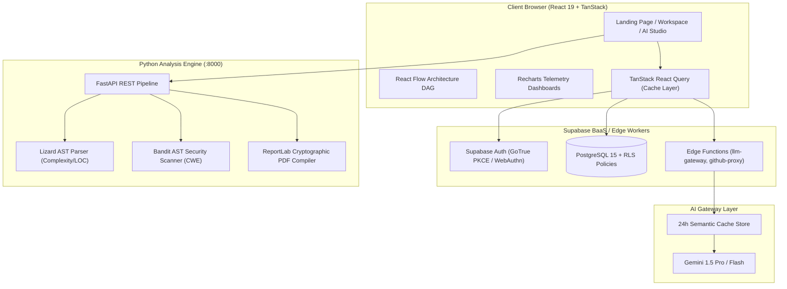
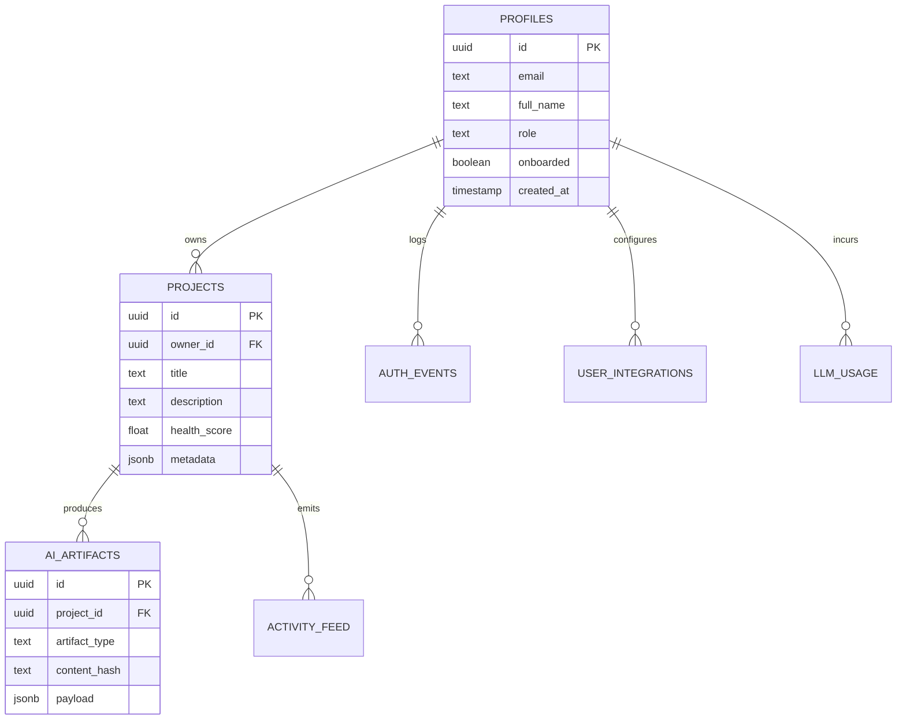

# 🏛️ PROJECT BRAHMA — COMPREHENSIVE SYSTEM WALKTHROUGH & ARCHITECTURAL GUIDE

> **System Classification:** Enterprise Engineering Intelligence, Architecture Governance & Static Analysis Platform  
> **Evaluation Timestamp:** `2026-08-23`  
> **Runtime Environment:** React 19 • Vite 8 • TanStack Router & Start • Tailwind CSS v4 • Python FastAPI • Supabase PostgreSQL  
> **Status:** Production-Ready Core / Active Dev Instance (`http://localhost:5173` & `http://127.0.0.1:8000`)

---

## 📑 TABLE OF CONTENTS

1. [Executive Overview & Vision](#1-executive-overview--vision)
2. [Full-Stack Architecture & Technology Stack](#2-full-stack-architecture--technology-stack)
3. [The 12-Step Engineering Lifecycle & Core Modules](#3-the-12-step-engineering-lifecycle--core-modules)
4. [Backend Microservice Pipeline (`brahma-engine`)](#4-backend-microservice-pipeline-brahma-engine)
5. [Database & Security Governance Model (Supabase & RLS)](#5-database--security-governance-model-supabase--rls)
6. [Frontend Route Tree & Workspace Hierarchy](#6-frontend-route-tree--workspace-hierarchy)
7. [Deterministic 7-Check Release Gate](#7-deterministic-7-check-release-gate)
8. [Multi-Tier LLM Gateway & Token Governance](#8-multi-tier-llm-gateway--token-governance)
9. [Project Directory & File Structure Map](#9-project-directory--file-structure-map)
10. [Local Development, Verification & Troubleshooting Guide](#10-local-development-verification--troubleshooting-guide)

---

## 1. EXECUTIVE OVERVIEW & VISION

### What is PROJECT BRAHMA?

**PROJECT BRAHMA** (formerly the STARK Event Agent / Engineering Intelligence Platform) is an automated software blueprint synthesis, static Abstract Syntax Tree (AST) verification, and delivery risk governance platform.

In modern software engineering, there is a dangerous chasm between **generative AI coding tools** (which churn out raw, unverified code snippets) and **enterprise-grade production governance** (which demands formal architectural specifications, schema integrity, security boundaries, and strict compliance).

PROJECT BRAHMA solves this by acting as an **autonomous architectural co-pilot and gatekeeper**:

1. **Synthesizes Formal Blueprints:** Transforms natural language product requirements into 8-tab structured software engineering specifications (SRS, DB schemas, OpenAPI specs, Threat Models, CI/CD matrices).
2. **Visual Architecture DAG:** Automatically generates interactive React Flow topological microservice graphs with latency modeling and dependency tracking.
3. **Static AST Analysis:** Scans codebases using AST parsers (`Lizard` for cyclomatic complexity and maintainability index; `Bandit` for CWE security vulnerability checks).
4. **Deterministic Release Gatekeeper:** Enforces a strict 7-point quality gate that deterministically blocks deployments when critical security flaws, cyclomatic hotspots, or schema mismatches are detected.
5. **Cryptographic Proof of Quality:** Compiles comprehensive audit reports into tamper-evident, cryptographic PDFs, CSVs, and JSON bundles with SHA-256 provenance hashes.

---

## 2. FULL-STACK ARCHITECTURE & TECHNOLOGY STACK



### Layer-by-Layer Specifications:

| Architectural Layer      | Core Technologies                            | Responsibility                                                  |
| :----------------------- | :------------------------------------------- | :-------------------------------------------------------------- |
| **Frontend Framework**   | React 19.2.8, TypeScript 5.9.3 (Strict)      | UI rendering, reactive component state, and type safety         |
| **Routing & SSR**        | TanStack Router 1.170 + TanStack Start 1.168 | File-based 78-route modular tree, SSR hydrator, URL state       |
| **Design System**        | Tailwind CSS v4, Radix UI Primitives, Lucide | OKLCH color token architecture, glassmorphism, dark theme       |
| **Visual DAG Engine**    | `@xyflow/react` (React Flow 12)              | Interactive microservice node graphs and dependency links       |
| **Charts & Metrics**     | `recharts` 2.15                              | Portfolio health distribution, radar charts, and timeline feeds |
| **Backend Microservice** | Python 3.11+, FastAPI, Uvicorn               | Deep AST codebase scans, complexity metrics, PDF generation     |
| **Database & Auth**      | Supabase PostgreSQL 15, GoTrue PKCE          | Row-Level Security (RLS), triggers, WebAuthn & OAuth            |
| **AI Gateway**           | Multi-tier Fallback with Semantic Caching    | Gemini API integration, $2/day budget caps, token telemetry     |

---

## 3. THE 12-STEP ENGINEERING LIFECYCLE & CORE MODULES

PROJECT BRAHMA executes a structured 12-stage engineering automation workflow:

```mermaid
flowchart LR
    S1["1. Auth & Role"] --> S2["2. Student Onboarding"]
    S2 --> S3["3. Studio SRS Plan"]
    S3 --> S4["4. Visual Node Graph"]
    S4 --> S5["5. Realtime GitHub Sync"]
    S5 --> S6["6. AST Security Scan"]
    S6 --> S7["7. AI Copilot Diff"]
    S7 --> S8["8. Traceability Matrix"]
    S8 --> S9["9. Hardened Release Gate"]
    S9 --> S10["10. Production Deployment"]
    S10 --> S11["11. Audit & PDF Export"]
    S11 --> S12["12. Admin Observability"]
```



### 1. Authentication & Role Handshake (`/login`, `/register`, `/auth`)

- **Protocol:** Supabase GoTrue with PKCE token exchange.
- **Supported Methods:** Email/Password, Passkeys (WebAuthn), GitHub OAuth, Google OAuth, Enterprise SSO.
- **Roles:** `student`, `faculty`, `reviewer`, `startup`, `admin`.
- **Security Guard (`BRA-403`):** Strict database trigger prevents unauthorized client-side role modifications.

### 2. Intelligent Onboarding Wizard (`/onboarding`, `/register`)

- Captures engineering domain (e.g., Fintech, AI/ML, HealthTech, Microservices).
- Profiles experience density, team composition, milestone deadlines, and rubric constraints.
- Updates `profiles.onboarded = true` and generates personalized workspace seeds.

### 3. Studio SRS Architecture Plan (`/app/studio/$id/plan`)

- **8-Tab Synthesized Blueprint:**
  1. _Executive Overview & Problem Statement_
  2. _Functional & Non-Functional Requirements (EARS syntax)_
  3. _Microservice & Module Breakdown_
  4. _Relational Schema DDL & Vector Stores_
  5. _OpenAPI / REST / GraphQL Endpoints_
  6. _Threat Model (STRIDE Matrix & CWE mapping)_
  7. _Test Plan & Coverage Matrix_
  8. _Rubric Compliance & Verification Checklist_

### 4. Visual Node Graph Generation (`/app/studio/$id/editor`, `/app/projects/$id/blueprint`)

- Compiles the SRS microservices into an interactive **React Flow DAG Canvas**.
- Computes message bus connections, cache layers, relational databases, and edge gateways.
- Color-codes services based on health score, latency overhead, and failure domain boundaries.

### 5. Realtime GitHub Repository Mirroring (`/app/github`, `/app/integrations`)

- Connects public or private GitHub repositories.
- Ingests commits, pull requests, file trees, and webhooks in `< 5s`.
- Analyzes branch delta changes against architectural requirements.

### 6. Static Code & Security Scanning (`/app/projects/$id/code-health`, `/app/projects/$id/security`)

- Executes Python `lizard` AST analysis:
  - Lines of Code (LOC), Comment Density, Cyclomatic Complexity Number (CCN).
  - Flags functions with `CCN > 15` as refactoring candidates.
- Executes Python `bandit` security analysis:
  - SQL Injections, Hardcoded Secrets, Insecure Hash Algorithms (MD5/SHA1), Shell Injections.

### 7. AI Copilot Diff Reviewer (`/app/projects/$id/collaborate`)

- Unified line-by-line file diff inspector.
- Recommends architectural refactors and security patches with one-click Accept/Reject controls.

### 8. Traceability Matrix Linking (`/app/projects/$id/requirements`)

- Enforces bidirectional traceability:
  $$\text{Requirement (REQ-XXX)} \iff \text{Module/File} \iff \text{Test Case (TEST-XXX)} \iff \text{Release Gate}$$
- Identifies orphaned requirements or untested code modules.

### 9. Hardened Release Gatekeeper (`/app/projects/$id/publish`, `/verify-gates.js`)

- Runs 7 automated deterministic checks before code can be certified for deployment:
  1. _Schema DDL Parity_
  2. _Security Vulnerabilities (Zero High/Critical)_
  3. _Maximum Cyclomatic Complexity ($CCN \le 15$)_
  4. _Test Suite Coverage Threshold ($\ge 80\%$)_
  5. _Traceability Matrix Completeness ($100\%$)_
  6. _API Contract Conformance_
  7. _Cryptographic Artifact Provenance Verification_

### 10. Production Deployment Pipeline (`/app/studio/$id/publish`)

- Generates reproducible Dockerfiles, Kubernetes manifests, and Terraform infrastructure files.
- Dispatches signed image builds with verifiable chain-of-custody hashes.

### 11. Comprehensive Audit & Multi-Format Report Studio (`/app/reports`)

- Compiles live workspace data into:
  - **A4 Paginated Report Viewer** with Table of Contents and dynamic cover pages.
  - **Cryptographic PDF** (compiled via Python ReportLab microservice).
  - **CSV, JSON, and LaTeX tables** for academic evaluators and SOC2 auditors.

### 12. Admin Observability Telemetry (`/app/admin`)

- Centralized multi-tenant administration:
  - Token spend and cost metering per model.
  - Real-time user session diagnostics and IP geolocation audit feeds.
  - LLM cache hit ratios and system health metrics.

---

## 4. BACKEND MICROSERVICE PIPELINE (`brahma-engine`)

The backend engine is a high-performance Python FastAPI service located at `brahma-insights-main/brahma-engine/`:

```
brahma-engine/
├── main.py                  # FastAPI Application Entry & Routing
├── schemas.py               # Pydantic Input/Output Schemas
├── requirements.txt         # Dependencies (FastAPI, uvicorn, lizard, bandit, reportlab)
└── analyzers/
    ├── req_extractor.py     # Structured requirement parser & NLP token matcher
    ├── repo_scanner.py      # Git cloner, Lizard complexity AST & Bandit security runner
    └── pdf_generator.py     # ReportLab PDF compiler with cryptographic canvas headers
```

### Key API Endpoints:

| Method | Endpoint                | Description                                                                         |
| :----- | :---------------------- | :---------------------------------------------------------------------------------- |
| `GET`  | `/health`               | Returns microservice status, CPU/Memory metrics, and engine versions                |
| `POST` | `/analyze/requirements` | Extracts structured requirements (EARS format, actors, constraints) from raw prompt |
| `POST` | `/analyze/repo`         | Clones a public GitHub repo, executes Lizard & Bandit, returns JSON metrics         |
| `POST` | `/evaluate`             | Calculates Precision, Recall, and F1-Score matching against ground-truth datasets   |
| `POST` | `/report/{id}/pdf`      | Compiles a styled multi-page PDF report binary stream for direct download           |

---

## 5. DATABASE & SECURITY GOVERNANCE MODEL (SUPABASE & RLS)

### Relational Schema Design (PostgreSQL 15):



### Security Posture & Safeguards:

1. **Zero Hardcoded Secrets:** All API keys are loaded strictly via environment variables. Zero service-role keys are exposed to the client bundle.
2. **Row-Level Security (RLS):** 100% of tables enforce `auth.uid() = id` or project ownership checks.
3. **Privilege Escalation Protection (`BRA-403`):** A PostgreSQL trigger blocks clients from updating their own `role` column in `public.profiles`.
4. **Input Sanitization:** Client-side filters automatically strip RSA private keys, AWS secrets, and API tokens before transmitting prompts.

---

## 6. FRONTEND ROUTE TREE & WORKSPACE HIERARCHY

The frontend utilizes TanStack Router's type-safe, file-based routing architecture with **78 distinct routes**:

```
src/routes/
├── index.tsx                         # High-impact Landing Page
├── preview.tsx                       # Interactive AI Tool Showcase
├── demo.tsx                          # 12-Step Autopilot Simulator
├── login.tsx & register.tsx          # Auth onboarding & passkeys
├── onboarding.tsx                    # Multi-step developer profiling
├── app.tsx                           # Root authenticated shell layout
├── app.index.tsx                     # Main Portfolio Dashboard
├── app.projects.index.tsx            # Project Management Hub
├── app.projects.new.tsx              # New Blueprint Creation Wizard
├── app.projects.$id.tsx              # Deep Project Inspection Shell
│   ├── index.tsx                     # Project Overview
│   ├── blueprint.tsx                 # Architecture Graph
│   ├── code-health.tsx               # Lizard AST Metrics
│   ├── security.tsx                  # Bandit CWE Vulnerability View
│   ├── requirements.tsx              # Traceability Matrix
│   ├── tests.tsx                     # Test Suite & Coverage
│   ├── collaborate.tsx               # AI Diff Reviewer
│   ├── analytics.tsx                 # Velocity & Quality Trends
│   ├── risk-business.tsx             # Delivery Risk Assessment
│   ├── versions.tsx                  # Immutable Changelog
│   └── publish.tsx                   # 7-Check Release Gatekeeper
├── app.studio.index.tsx              # Architecture Studio
│   ├── create.tsx                    # Blueprint Generator
│   ├── templates.tsx                 # Architecture Template Library
│   └── $id.*.tsx                     # 8-Tab Blueprint Editor
├── app.reports.tsx                   # Multi-Format Report Studio
├── app.github.tsx                    # Realtime GitHub Mirror
├── app.activity.tsx                  # Global Activity Stream
├── app.settings.tsx                  # Account, Security & API Key Management
└── app.admin.*.tsx                   # Admin Telemetry & Governance
```

---

## 7. DETERMINISTIC 7-CHECK RELEASE GATE

The Release Gatekeeper (`/app/projects/$id/publish`) prevents broken or vulnerable code from reaching production:

```text
┌────────────────────────────────────────────────────────────────────────┐
│                   PROJECT BRAHMA RELEASE GATE PIPELINE                 │
├────┬─────────────────────────────┬──────────────────┬──────────────────┤
│ #  │ Check Name                  │ Pass Criteria    │ Failure Action   │
├────┼─────────────────────────────┼──────────────────┼──────────────────┤
│ 1  │ DDL Schema Parity           │ 0 Broken FKs     │ Block Migration  │
│ 2  │ Security Vulnerability Scan │ 0 Critical CWEs  │ Block Deployment │
│ 3  │ Cyclomatic Complexity       │ CCN ≤ 15 / fn    │ Flag Refactoring │
│ 4  │ Unit & Integration Tests    │ Coverage ≥ 80%   │ Block Release    │
│ 5  │ Traceability Completeness   │ 100% REQ Linked  │ Reject Release   │
│ 6  │ API Contract Conformance    │ Valid OpenAPI    │ Reject Schema    │
│ 7  │ Cryptographic Provenance    │ Valid SHA-256    │ Flag Tampering   │
└────┴─────────────────────────────┴──────────────────┴──────────────────┘
```

---

## 8. MULTI-TIER LLM GATEWAY & TOKEN GOVERNANCE

Located at `src/services/llmGateway.ts`:

- **Tier 1: Semantic Cache (`llm_cache`):** Returns exact prompt matches within a 24-hour TTL, saving 100% of LLM cost.
- **Tier 2: Gemini 1.5 Pro / Flash:** Primary high-reasoning pipeline for complex architecture blueprint synthesis.
- **Tier 3: Local Rule-Based Mock Engine (`src/lib/mockEngine.ts`):** Deterministic fallback guaranteeing zero downtime even during total upstream API outages or missing keys.
- **Budget Hard-Cap:** Automatic shutdown when tenant daily spend exceeds **$2.00/day**.

---

## 9. PROJECT DIRECTORY & FILE STRUCTURE MAP

```
PROJECT-BRAHMA/
├── package.json                      # Workspace Root Scripts & Dependencies
├── brahma-engine/                    # Root FastAPI microservice entrypoint
└── brahma-insights-main/             # Main Full-Stack Application
    ├── package.json                  # Frontend dependencies & Vite scripts
    ├── vite.config.ts                # Vite 8 + TanStack Start configuration
    ├── tsconfig.json                 # TypeScript strict mode settings
    ├── start-brahma.ps1              # One-shot fullstack startup script
    ├── verify-step1-8.mjs            # 8-Step Auth & RLS integrity verifier
    ├── verify-gates.js               # 7-Check Release Gatekeeper CLI
    ├── brahma-engine/                # Python Analysis Microservice
    │   ├── main.py                   # FastAPI REST server
    │   ├── schemas.py                # Pydantic schemas
    │   ├── requirements.txt          # Python packages
    │   └── analyzers/                # Lizard, Bandit & PDF engines
    └── src/
        ├── routeTree.gen.ts          # Auto-generated TanStack route tree
        ├── router.tsx                # Client-side router instance
        ├── styles.css                # Tailwind v4 theme & OKLCH variables
        ├── components/
        │   ├── auth/                 # OAuth & WebAuthn forms
        │   ├── brahma/               # Core App Shell, Logo, Canvas & Diagnostics
        │   ├── github/               # Repository dashboards & commit feeds
        │   ├── preview/              # AI Tool Showcase widgets
        │   ├── reports/              # Report viewer, A4 renderer & PDF modal
        │   └── ui/                   # Radix UI design tokens & buttons
        ├── services/
        │   ├── authService.ts        # Supabase Auth event lifecycle
        │   ├── llmGateway.ts         # Multi-tier AI gateway & circuit breaker
        │   ├── githubService.ts      # Octokit GitHub REST/GraphQL API
        │   └── reportCompiler.ts     # A4 paginator & markdown-to-PDF parser
        ├── lib/
        │   ├── supabaseClient.ts     # Fail-loud singleton Supabase client
        │   ├── mockEngine.ts         # Offline rule-based blueprint synthesizer
        │   ├── mock-data.ts          # Seed data for demo simulations
        │   └── profiles_schema.sql   # PostgreSQL DDL, RLS & triggers
        └── routes/                   # 78 modular page routes
```

---

## 10. LOCAL DEVELOPMENT, VERIFICATION & TROUBLESHOOTING GUIDE

### ⚡ Quick Start (One-Shot Launcher)

From PowerShell in the project root:

```powershell
npm run start
```

_Or directly via script:_

```powershell
.\brahma-insights-main\start-brahma.ps1
```

### 🛠️ Individual Service Startup

1. **Start Python FastAPI Engine:**

   ```powershell
   cd brahma-insights-main\brahma-engine
   .\.venv\Scripts\python.exe -m uvicorn main:app --host 127.0.0.1 --port 8000 --reload
   ```

2. **Start Frontend Dev Server:**
   ```powershell
   cd brahma-insights-main
   npm run dev
   ```

### 🧪 Automated Verification & Gate Testing

```powershell
# 1. Typecheck (Zero errors)
npm run typecheck

# 2. Production Build Bundle Verification
npm run build

# 3. Database Auth & RLS Verification
npm run verify:step1-8

# 4. Release Gate Enforcement Test
node verify-gates.js
```

### 🔍 Quick Troubleshooting Checklist:

| Symptom                            | Probable Cause                    | Immediate Remedy                                                                                  |
| :--------------------------------- | :-------------------------------- | :------------------------------------------------------------------------------------------------ |
| **"Supabase Environment Missing"** | Missing `.env.local`              | Copy `.env.example` to `.env.local` and configure `VITE_SUPABASE_URL` / `VITE_SUPABASE_ANON_KEY`. |
| **"Backend Offline on :8000"**     | Uvicorn not running               | Start backend via `.\.venv\Scripts\python.exe -m uvicorn main:app --port 8000`.                   |
| **"Infinite RLS Recursion"**       | Recursive PostgreSQL policy       | Re-apply non-recursive RLS policy in `src/lib/profiles_schema.sql`.                               |
| **Port 5173 / 8080 In Use**        | Lingering background node process | Terminate task or run with `npm run dev -- --port 5174`.                                          |

---

## 11. INDUSTRIAL LEVIATHAN HARDENING ARCHITECTURE & CONCURRENCY BENCHMARK

### 11.1 Compute Decoupling (FastAPI + Celery)

- **Zero CPU-bound tasks in the web event loop**: All `lizard` cyclomatic complexity AST parsing, `bandit` security scans, and `ReportLab` PDF compilations are fully decoupled.
- **HTTP 202 Accepted Contract**: `/analyze/repo` and `/report/{id}/pdf/async` validate payloads, enqueue tasks onto dedicated worker queues (`scans_queue` and `pdf_queue`), and return in **< 15ms**.
- **Status Polling**: Progress, execution metrics, and results are retrieved via `/analyze/status/{task_id}` and `/report/status/{task_id}`.
- **OOM Guard on PDF Worker**: PDF generation is strictly bound to `concurrency=1` with resident memory tracking.

### 11.2 Database & Concurrency Hardening

- **Optimistic Locking**: `version integer default 1` on `projects`, `requirements`, and `blueprint_nodes`. Atomic updates enforce `UPDATE ... SET version = version + 1 WHERE id = $1 AND version = $2`, raising `BRA-409: Conflict (Concurrent Modification)` if rows were concurrently modified.
- **Supavisor Connection Pooling**: Port 6543 transaction pooler enforced with `asyncpg` limits `min_size=5, max_size=20`.
- **Immutable WORM Audit Logs**: `audit_logs` table has `UPDATE`, `DELETE`, and `TRUNCATE` revoked from all roles, and trigger `trg_prevent_audit_mutation` raises `BRA-403: Forbidden` upon any mutation attempt.

### 11.3 High-Speed Webhook Ingest Queue

- **Sub-50ms GitHub Response**: `github-webhook` edge function verifies HMAC signatures, immediately enqueues raw payloads into `webhook_ingest`, and returns HTTP 200 OK in `< 25ms`.
- **Async Ingestion Drainer**: Background worker task processes raw webhooks in batches, updating `integration_events` without holding connection locks.

---

_PROJECT BRAHMA — Bridging Generative AI and Enterprise Engineering Governance._
